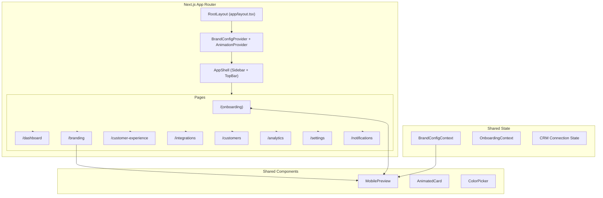

# Design Document: Servvo Business Platform

## Overview

The Servvo Business Platform is a frontend-only Next.js 14 web application that enables lawn care business owners to onboard, configure white-label branding, manage mock CRM integrations, customize customer experience messaging, and view analytics. It lives at `apps/web/` in the existing Servvo monorepo.

The platform is a demo-quality, investor-ready prototype. All data is local/mock — no backend, no APIs, no auth. The architecture prioritizes visual polish, smooth animations, and a premium editorial aesthetic consistent with the existing Servvo mobile app design language.

**Key Architectural Decisions:**
- Next.js 14 App Router for file-based routing and layouts
- shadcn/ui as the base component library, customized with Servvo design tokens
- Framer Motion for all animations (page transitions, card entrances, hover states)
- React Context + useReducer for global Brand_Config state
- Recharts for analytics charts
- Tailwind CSS with a custom theme extending Servvo design tokens from `apps/mobile/src/theme/tokens.ts`

## Architecture

### High-Level Architecture



### Folder Structure

```
apps/web/
├── package.json
├── next.config.js
├── tailwind.config.ts
├── tsconfig.json
├── postcss.config.js
├── public/
│   ├── images/
│   │   ├── crm-logos/          # Jobber, Housecall Pro, ServiceTitan logos
│   │   ├── imagery-styles/     # Curated imagery style previews
│   │   └── onboarding/        # Onboarding illustration assets
│   └── fonts/
├── src/
│   ├── app/
│   │   ├── layout.tsx          # Root layout with providers
│   │   ├── page.tsx            # Redirect to /onboarding or /dashboard
│   │   ├── globals.css         # Tailwind directives + custom CSS vars
│   │   ├── (onboarding)/
│   │   │   └── onboarding/
│   │   │       └── page.tsx    # Onboarding wizard page
│   │   └── (platform)/
│   │       ├── layout.tsx      # AppShell layout (sidebar + topbar)
│   │       ├── dashboard/
│   │       │   └── page.tsx
│   │       ├── branding/
│   │       │   └── page.tsx
│   │       ├── customer-experience/
│   │       │   └── page.tsx
│   │       ├── integrations/
│   │       │   └── page.tsx
│   │       ├── notifications/
│   │       │   └── page.tsx
│   │       ├── customers/
│   │       │   └── page.tsx
│   │       ├── analytics/
│   │       │   └── page.tsx
│   │       └── settings/
│   │           └── page.tsx
│   ├── components/
│   │   ├── ui/                 # shadcn/ui components (Button, Card, Input, etc.)
│   │   ├── layout/
│   │   │   ├── AppShell.tsx
│   │   │   ├── Sidebar.tsx
│   │   │   ├── SidebarItem.tsx
│   │   │   ├── TopBar.tsx
│   │   │   └── ContentArea.tsx
│   │   ├── onboarding/
│   │   │   ├── OnboardingWizard.tsx
│   │   │   ├── WelcomeStep.tsx
│   │   │   ├── BusinessInfoStep.tsx
│   │   │   ├── LogoUploadStep.tsx
│   │   │   ├── BrandColorsStep.tsx
│   │   │   ├── TerminologyStep.tsx
│   │   │   ├── ImageryStyleStep.tsx
│   │   │   ├── CRMConnectionStep.tsx
│   │   │   ├── AppPreviewStep.tsx
│   │   │   ├── CompletionStep.tsx
│   │   │   ├── StepProgressBar.tsx
│   │   │   └── StepTransition.tsx
│   │   ├── branding/
│   │   │   ├── BrandingStudio.tsx
│   │   │   ├── LogoUploader.tsx
│   │   │   ├── ColorPickerPanel.tsx
│   │   │   ├── TypographySelector.tsx
│   │   │   ├── ImagerySelector.tsx
│   │   │   ├── TerminologySelector.tsx
│   │   │   └── ToneSelector.tsx
│   │   ├── preview/
│   │   │   ├── MobilePreview.tsx
│   │   │   ├── PhoneFrame.tsx
│   │   │   ├── PreviewScreen.tsx
│   │   │   ├── screens/
│   │   │   │   ├── HomeDashboardScreen.tsx
│   │   │   │   ├── ServiceStatusScreen.tsx
│   │   │   │   └── ProviderProfileScreen.tsx
│   │   │   └── PreviewNavigation.tsx
│   │   ├── crm/
│   │   │   ├── IntegrationCard.tsx
│   │   │   ├── ConnectionFlow.tsx
│   │   │   └── IntegrationGrid.tsx
│   │   ├── customer-experience/
│   │   │   ├── ToneSelector.tsx
│   │   │   ├── NotificationTemplateEditor.tsx
│   │   │   ├── ServiceStatusMessages.tsx
│   │   │   ├── ReviewRequestSettings.tsx
│   │   │   └── RebookingSettings.tsx
│   │   ├── customers/
│   │   │   ├── CustomerList.tsx
│   │   │   ├── CustomerCard.tsx
│   │   │   ├── CustomerDetailPanel.tsx
│   │   │   └── EngagementSummary.tsx
│   │   ├── analytics/
│   │   │   ├── MetricCard.tsx
│   │   │   ├── EngagementChart.tsx
│   │   │   ├── BookingsChart.tsx
│   │   │   └── CountUpNumber.tsx
│   │   └── shared/
│   │       ├── AnimatedCard.tsx
│   │       ├── PageTransition.tsx
│   │       ├── ConfettiCelebration.tsx
│   │       └── DesktopOnlyMessage.tsx
│   ├── contexts/
│   │   ├── BrandConfigContext.tsx
│   │   ├── OnboardingContext.tsx
│   │   └── CRMContext.tsx
│   ├── hooks/
│   │   ├── useBrandConfig.ts
│   │   ├── useOnboarding.ts
│   │   ├── useCRMConnections.ts
│   │   └── useCountUp.ts
│   ├── data/
│   │   ├── mockCustomers.ts
│   │   ├── mockAnalytics.ts
│   │   ├── mockNotificationTemplates.ts
│   │   ├── mockCRMIntegrations.ts
│   │   └── defaults.ts
│   ├── lib/
│   │   ├── utils.ts            # cn() helper, general utilities
│   │   ├── colorUtils.ts       # Ported from mobile app
│   │   └── terminology.ts      # Ported from mobile app
│   └── types/
│       ├── brand.ts
│       ├── customer.ts
│       ├── analytics.ts
│       ├── crm.ts
│       └── onboarding.ts
```

### Routing Strategy

The app uses Next.js App Router route groups to separate the onboarding flow from the main platform:

| Route Group | Layout | Purpose |
|---|---|---|
| `(onboarding)` | Minimal (no sidebar) | Full-screen onboarding wizard |
| `(platform)` | AppShell (sidebar + topbar) | All post-onboarding sections |

The root `page.tsx` checks local state: if onboarding is incomplete, redirect to `/onboarding`; otherwise redirect to `/dashboard`.

## Components and Interfaces

### Layout Components

```typescript
// components/layout/AppShell.tsx
interface AppShellProps {
  children: React.ReactNode;
}

// components/layout/Sidebar.tsx
interface SidebarProps {
  collapsed: boolean;
  activeItem: string;
  onNavigate: (path: string) => void;
}

interface SidebarNavItem {
  id: string;
  label: string;
  icon: React.ComponentType<{ className?: string }>;
  path: string;
}

// components/layout/TopBar.tsx
interface TopBarProps {
  businessName: string;
  avatarUrl?: string;
}
```

### Onboarding Components

```typescript
// components/onboarding/OnboardingWizard.tsx
interface OnboardingWizardProps {
  initialStep?: number;
}

// Each step component receives:
interface StepProps {
  onNext: () => void;
  onBack: () => void;
}

// components/onboarding/StepProgressBar.tsx
interface StepProgressBarProps {
  currentStep: number;
  totalSteps: number;
  stepLabels: string[];
}

// components/onboarding/StepTransition.tsx
interface StepTransitionProps {
  children: React.ReactNode;
  direction: 'forward' | 'backward';
  stepKey: string;
}
```

### Branding Studio Components

```typescript
// components/branding/BrandingStudio.tsx
interface BrandingStudioProps {}
// Internally reads from BrandConfigContext and renders side-by-side layout

// components/branding/ColorPickerPanel.tsx
interface ColorPickerPanelProps {
  label: string;
  value: string;
  presets: string[];
  onChange: (color: string) => void;
}

// components/branding/TypographySelector.tsx
interface TypographySelectorProps {
  value: string;
  options: FontPairing[];
  onChange: (fontId: string) => void;
}

interface FontPairing {
  id: string;
  name: string;
  headingFont: string;
  bodyFont: string;
  preview: string; // Preview text rendered in the font
}

// components/branding/TerminologySelector.tsx
interface TerminologySelectorProps {
  value: ProviderTerminology;
  onChange: (term: ProviderTerminology) => void;
}

type ProviderTerminology = 'Provider' | 'Crew' | 'Team' | 'Service Professional';

// components/branding/LogoUploader.tsx
interface LogoUploaderProps {
  currentLogo: string | null;
  onUpload: (dataUrl: string) => void;
}
```

### Mobile Preview Components

```typescript
// components/preview/MobilePreview.tsx
interface MobilePreviewProps {
  mode?: 'panel' | 'overlay';
  className?: string;
}

// components/preview/PhoneFrame.tsx
interface PhoneFrameProps {
  children: React.ReactNode;
  className?: string;
}

// components/preview/PreviewScreen.tsx
interface PreviewScreenProps {
  screenId: 'home' | 'service-status' | 'provider-profile';
  brandConfig: BrandConfig;
}
```

### CRM Integration Components

```typescript
// components/crm/IntegrationCard.tsx
interface IntegrationCardProps {
  integration: CRMIntegration;
  isConnected: boolean;
  lastSynced?: Date;
  onConnect: () => void;
  onDisconnect: () => void;
}

interface CRMIntegration {
  id: string;
  name: string;
  description: string;
  logoUrl: string;
}
```

### Analytics Components

```typescript
// components/analytics/MetricCard.tsx
interface MetricCardProps {
  label: string;
  value: number;
  format?: 'number' | 'percentage' | 'rating';
  trend?: { direction: 'up' | 'down'; percentage: number };
  animateOnMount?: boolean;
}

// components/analytics/CountUpNumber.tsx
interface CountUpNumberProps {
  end: number;
  duration?: number; // ms, default 1500
  format?: (value: number) => string;
}

// components/analytics/EngagementChart.tsx
interface EngagementChartProps {
  data: { date: string; sessions: number }[];
}

// components/analytics/BookingsChart.tsx
interface BookingsChartProps {
  data: { week: string; bookings: number }[];
}
```

### Customer Components

```typescript
// components/customers/CustomerList.tsx
interface CustomerListProps {
  customers: Customer[];
  onSelectCustomer: (id: string) => void;
}

// components/customers/CustomerCard.tsx
interface CustomerCardProps {
  customer: Customer;
  onClick: () => void;
}

// components/customers/CustomerDetailPanel.tsx
interface CustomerDetailPanelProps {
  customer: Customer;
  onClose: () => void;
}

// components/customers/EngagementSummary.tsx
interface EngagementSummaryProps {
  totalCustomers: number;
  activeCustomers: number;
  dueForRebooking: number;
}
```

### Shared Animation Components

```typescript
// components/shared/AnimatedCard.tsx
interface AnimatedCardProps {
  children: React.ReactNode;
  delay?: number;       // stagger delay in seconds
  className?: string;
}

// components/shared/PageTransition.tsx
interface PageTransitionProps {
  children: React.ReactNode;
}

// components/shared/ConfettiCelebration.tsx
interface ConfettiCelebrationProps {
  trigger: boolean;
  duration?: number;
}
```

## Data Models

### BrandConfig (Central State Object)

```typescript
// types/brand.ts
export interface BrandConfig {
  businessName: string;
  phone: string;
  email: string;
  logo: string | null;           // Data URL or null
  colors: {
    primary: string;             // Hex color, default: '#2D4A2D'
    accent: string;              // Hex color, default: '#5C8A4D'
  };
  typography: {
    fontPairingId: string;       // ID of selected font pairing
  };
  terminology: ProviderTerminology;
  imageryStyle: string;          // ID of selected imagery style
  messagingTone: MessagingTone;
  notifications: NotificationSettings;
}

export type ProviderTerminology = 'Provider' | 'Crew' | 'Team' | 'Service Professional';
export type MessagingTone = 'professional' | 'friendly' | 'luxury' | 'modern';

export interface NotificationSettings {
  templates: NotificationTemplate[];
  autoReviewRequest: boolean;
  reviewRequestDelay: number;    // hours after service
  autoRebooking: boolean;
}

export interface NotificationTemplate {
  id: string;
  type: 'appointment_confirmation' | 'service_in_progress' | 'service_complete' | 'review_request';
  subject: string;
  body: string;
}
```

### Onboarding State

```typescript
// types/onboarding.ts
export interface OnboardingState {
  isComplete: boolean;
  currentStep: number;
  data: Partial<BrandConfig>;
  crmSelections: string[];       // IDs of "connected" CRMs during onboarding
}
```

### CRM Integration

```typescript
// types/crm.ts
export interface CRMIntegration {
  id: string;
  name: string;
  description: string;
  logoUrl: string;
}

export interface CRMConnectionState {
  integrationId: string;
  isConnected: boolean;
  connectedAt?: Date;
  lastSynced?: Date;
}
```

### Customer

```typescript
// types/customer.ts
export interface Customer {
  id: string;
  name: string;
  email: string;
  phone: string;
  propertyAddress: string;
  lastServiceDate: string;
  engagementStatus: 'active' | 'inactive' | 'due_for_rebooking';
  serviceHistory: ServiceRecord[];
  metrics: CustomerMetrics;
}

export interface ServiceRecord {
  id: string;
  date: string;
  serviceType: string;
  provider: string;
  rating?: number;
}

export interface CustomerMetrics {
  totalServices: number;
  averageRating: number;
  lifetimeValue: number;
  lastEngagement: string;
}
```

### Analytics

```typescript
// types/analytics.ts
export interface AnalyticsMetrics {
  totalCustomers: number;
  repeatBookingRate: number;     // percentage
  averageReviewRating: number;   // 1-5
  retentionRate: number;         // percentage
  weeklyAppSessions: number;
}

export interface EngagementDataPoint {
  date: string;                  // ISO date string
  sessions: number;
}

export interface BookingsDataPoint {
  week: string;                  // e.g., "Week 1", "Week 2"
  bookings: number;
}
```

### Context State Shape

```typescript
// contexts/BrandConfigContext.tsx
export interface BrandConfigState {
  config: BrandConfig;
  isOnboarded: boolean;
}

export type BrandConfigAction =
  | { type: 'SET_BUSINESS_INFO'; payload: { businessName: string; phone: string; email: string } }
  | { type: 'SET_LOGO'; payload: string | null }
  | { type: 'SET_COLORS'; payload: { primary: string; accent: string } }
  | { type: 'SET_TYPOGRAPHY'; payload: string }
  | { type: 'SET_TERMINOLOGY'; payload: ProviderTerminology }
  | { type: 'SET_IMAGERY_STYLE'; payload: string }
  | { type: 'SET_MESSAGING_TONE'; payload: MessagingTone }
  | { type: 'SET_NOTIFICATIONS'; payload: NotificationSettings }
  | { type: 'SET_ONBOARDED'; payload: boolean }
  | { type: 'RESET' };
```

### Default Values

```typescript
// data/defaults.ts
export const DEFAULT_BRAND_CONFIG: BrandConfig = {
  businessName: '',
  phone: '',
  email: '',
  logo: null,
  colors: {
    primary: '#2D4A2D',
    accent: '#5C8A4D',
  },
  typography: {
    fontPairingId: 'classic',
  },
  terminology: 'Provider',
  imageryStyle: 'natural',
  messagingTone: 'professional',
  notifications: {
    templates: [...DEFAULT_NOTIFICATION_TEMPLATES],
    autoReviewRequest: true,
    reviewRequestDelay: 24,
    autoRebooking: true,
  },
};
```


## Correctness Properties

*A property is a characteristic or behavior that should hold true across all valid executions of a system — essentially, a formal statement about what the system should do. Properties serve as the bridge between human-readable specifications and machine-verifiable correctness guarantees.*

### Property 1: Brand config reducer correctness

*For any* valid `BrandConfigAction` dispatched to the brand config reducer, the resulting state SHALL contain the dispatched value at the correct path in the `BrandConfig` object, and all other fields SHALL remain unchanged.

**Validates: Requirements 3.9, 10.1**

### Property 2: Preview reflects brand config

*For any* valid `BrandConfig` object (with any valid hex colors, any valid terminology, and any logo value), the Mobile_Preview component SHALL render elements that reflect the config's primary color, accent color, and terminology value.

**Validates: Requirements 2.12, 3.8, 4.3**

### Property 3: Onboarding back navigation preserves data

*For any* valid onboarding form data entered at a given step, navigating forward and then backward SHALL preserve all previously entered field values without modification.

**Validates: Requirements 2.5**

### Property 4: Business information validation

*For any* string input, the business information validation function SHALL accept inputs that match valid formats (non-empty name, valid email format, valid phone format) and reject all others, returning appropriate error messages for each invalid field.

**Validates: Requirements 2.6**

### Property 5: CRM connect/disconnect round-trip

*For any* CRM integration, connecting and then disconnecting SHALL return the integration to its initial unconnected state (isConnected: false, no connectedAt, no lastSynced).

**Validates: Requirements 5.5**

### Property 6: Tone-to-template mapping

*For any* valid messaging tone selection, all notification template previews SHALL update to contain text that corresponds to the selected tone's predefined variants, and no template SHALL display text from a different tone.

**Validates: Requirements 6.2**

### Property 7: Customer search filtering

*For any* customer list and any search query string, the filtered results SHALL only contain customers whose name or address includes the search term (case-insensitive), and no matching customer SHALL be excluded from the results.

**Validates: Requirements 7.3**

### Property 8: Engagement summary computation

*For any* list of customers with various engagement statuses, the engagement summary SHALL report totalCustomers equal to the list length, activeCustomers equal to the count of customers with 'active' status, and dueForRebooking equal to the count of customers with 'due_for_rebooking' status.

**Validates: Requirements 7.4**

### Property 9: Color contrast WCAG compliance

*For any* combination of text color and background color from the Servvo design token palette, the computed contrast ratio SHALL meet WCAG 2.1 AA thresholds (≥ 4.5:1 for body text, ≥ 3:1 for large text).

**Validates: Requirements 9.7**

### Property 10: State persistence across navigation

*For any* valid brand config state, navigating between platform sections (simulated by unmounting and remounting child components while the context provider remains mounted) SHALL preserve the complete state without data loss.

**Validates: Requirements 10.3, 2.14**

## Error Handling

### State Corruption Recovery

When the `BrandConfigContext` initializes, it validates the stored state shape. If the state is malformed or contains invalid values (e.g., non-hex color strings, unknown terminology values), the context resets to `DEFAULT_BRAND_CONFIG` and sets `isOnboarded: false`, which triggers the onboarding welcome screen.

```typescript
function initializeState(): BrandConfigState {
  try {
    // Validate state shape and values
    const stored = getStoredState();
    if (isValidBrandConfig(stored.config)) {
      return stored;
    }
    throw new Error('Invalid state shape');
  } catch {
    return { config: DEFAULT_BRAND_CONFIG, isOnboarded: false };
  }
}
```

### File Upload Errors

The `LogoUploader` component handles:
- Invalid file types (non-image): Display inline error message, reject the file
- Files exceeding size limit (> 5MB): Display size warning, reject the file
- FileReader errors: Display generic upload error, allow retry

### Color Input Validation

The `ColorPickerPanel` validates hex input:
- Invalid hex format: Revert to previous valid color, show inline error
- Colors that would violate WCAG contrast: Show a warning indicator (non-blocking)

### Navigation Guards

The onboarding wizard does not block navigation, but preserves state. If the user navigates away mid-onboarding (e.g., via browser back), returning to `/onboarding` restores their progress from context state.

### Component Error Boundaries

Each major section (BrandingStudio, Analytics, Customers, etc.) is wrapped in a React Error Boundary that:
- Catches render errors
- Displays a friendly "Something went wrong" card with a retry button
- Logs the error to console (no external service in this prototype)

## Testing Strategy

### Unit Tests (Vitest + React Testing Library)

Unit tests cover specific examples, edge cases, and component rendering:

- **Component rendering**: Verify each page and component renders expected elements
- **User interactions**: Click handlers, form submissions, navigation
- **Edge cases**: Empty states, corrupted data, boundary values
- **Accessibility**: ARIA attributes, keyboard navigation, focus management

### Property-Based Tests (fast-check + Vitest)

Property-based tests verify universal correctness properties using the `fast-check` library with a minimum of 100 iterations per property:

| Property | Test Target | Generator Strategy |
|---|---|---|
| Property 1: Reducer correctness | `brandConfigReducer` | Generate random valid actions and verify state transitions |
| Property 2: Preview reflects config | `MobilePreview` component | Generate random hex colors and terminology values |
| Property 3: Back navigation | `OnboardingWizard` state | Generate random form field values |
| Property 4: Validation | `validateBusinessInfo` | Generate random strings (valid and invalid emails, phones, names) |
| Property 5: CRM round-trip | `CRMContext` reducer | Generate random CRM integration IDs |
| Property 6: Tone mapping | `getTemplatesForTone` | Generate random tone selections |
| Property 7: Customer search | `filterCustomers` | Generate random customer lists and search queries |
| Property 8: Engagement summary | `computeEngagementSummary` | Generate random customer lists with varied statuses |
| Property 9: WCAG contrast | `contrastRatio` utility | Generate color pairs from the token palette |
| Property 10: State persistence | `BrandConfigContext` | Generate random complete brand configs |

Each property test is tagged with:
```
// Feature: servvo-business-platform, Property {N}: {property_text}
```

### Integration Tests

- Full onboarding flow walkthrough (step through all 9 steps)
- Branding Studio ↔ Mobile Preview reactivity
- Navigation between all platform sections preserving state

### Test Configuration

```typescript
// vitest.config.ts
export default defineConfig({
  test: {
    environment: 'jsdom',
    setupFiles: ['./src/test/setup.ts'],
    globals: true,
  },
});
```

### Libraries

- **Test runner**: Vitest
- **Component testing**: @testing-library/react
- **Property-based testing**: fast-check
- **Animation mocking**: Mock Framer Motion in tests to avoid animation timing issues

