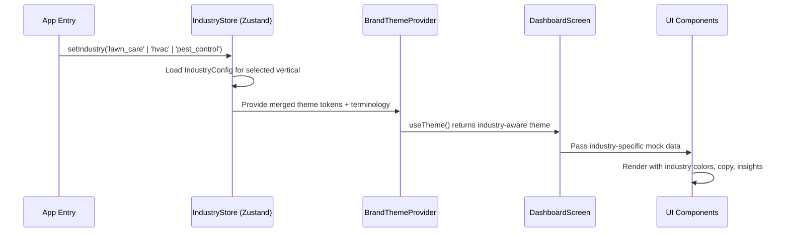

# Design Document: Servvo Industry Verticals

## Overview

This feature adds an industry configuration layer to the existing Servvo mobile app, enabling HVAC and Pest Control verticals alongside the existing Lawn Care experience. The same codebase, components, and navigation are used — the industry config drives different theme colors, hero copy, imagery, mock data, property insight cards, activity events, and seasonal tips. The architecture extends the existing `BrandConfig` and `BrandThemeProvider` pattern with a new `IndustryConfig` type that bundles all per-vertical content into a single switchable configuration object.

## Main Algorithm/Workflow



## Core Interfaces/Types

```typescript
// src/config/industry.types.ts

/** Supported industry verticals */
export type IndustryVertical = 'lawn_care' | 'hvac' | 'pest_control';

/** Color palette override per industry */
export interface IndustryColors {
  primary: string;
  primaryLight: string;
  accent: string;
  accentLight: string;
  background: string;
  success: string;
  warning: string;
}

/** Gradient overrides per industry */
export interface IndustryGradients {
  heroOverlay: string[];
  buttonPrimary: string[];
}

/** Hero section configuration */
export interface IndustryHero {
  /** Greeting suffix — replaces the evening greeting in buildGreeting */
  greetingLine: string;
  /** Hero background image URI */
  imageUri: string;
}

/** A single property insight card definition */
export interface InsightCardConfig {
  id: string;
  icon: string; // Feather icon name
  iconColor: string;
  label: string;
  /** Static display value for mock/demo */
  value: string;
  /** Optional background tint */
  backgroundTint?: string;
}

/** Appointment/service type definition */
export interface ServiceTypeConfig {
  id: string;
  name: string;
  /** Default duration in minutes */
  duration: number;
}

/** A single activity event for mock data */
export interface IndustryEvent {
  id: string;
  title: string;
  timestamp: Date;
  status: 'completed' | 'scheduled';
}

/** Seasonal tips mapped by month (1-12) */
export type SeasonalTipsMap = Record<number, string>;

/** The complete industry configuration object */
export interface IndustryConfig {
  vertical: IndustryVertical;
  displayName: string;

  /** Theme overrides */
  colors: IndustryColors;
  gradients: IndustryGradients;

  /** Terminology */
  terminology: {
    serviceProvider: string; // "Service Professional" | "Technician" | "Specialist"
    propertyNoun: string;   // "property" | "home" | "home"
    serviceNoun: string;    // "service" | "maintenance" | "treatment"
  };

  /** Hero section */
  hero: IndustryHero;

  /** Property insight cards (exactly 3) */
  insightCards: [InsightCardConfig, InsightCardConfig, InsightCardConfig];

  /** Available service types for this industry */
  serviceTypes: ServiceTypeConfig[];

  /** Mock appointment for demo */
  mockAppointment: {
    serviceType: string;
    providerName: string;
    providerAvatarUri?: string;
    date: string;
    time: string;
  };

  /** Mock activity events */
  mockEvents: IndustryEvent[];

  /** Seasonal tips by month */
  seasonalTips: SeasonalTipsMap;
}
```

## Key Functions with Formal Specifications

### Function 1: getIndustryConfig()

```typescript
function getIndustryConfig(vertical: IndustryVertical): IndustryConfig
```

**Preconditions:**
- `vertical` is one of `'lawn_care' | 'hvac' | 'pest_control'`

**Postconditions:**
- Returns a complete `IndustryConfig` object for the given vertical
- All fields are non-null and well-formed
- `insightCards` array has exactly 3 elements
- `seasonalTips` has entries for months 1-12
- `mockEvents` has at least 3 events

**Loop Invariants:** N/A

---

### Function 2: buildIndustryTheme()

```typescript
function buildIndustryTheme(config: IndustryConfig): Theme
```

**Preconditions:**
- `config` is a valid `IndustryConfig` (all fields populated)
- `config.colors` contains valid hex color strings

**Postconditions:**
- Returns a `Theme` object compatible with `BrandThemeProvider`
- `theme.tokens.colors` merges `config.colors` over `defaultTokens.colors`
- `theme.tokens.gradients` uses `config.gradients`
- `theme.terminology.serviceProvider` equals `config.terminology.serviceProvider`
- Non-overridden token values (spacing, typography, shadows, etc.) remain unchanged from `defaultTokens`

**Loop Invariants:** N/A

---

### Function 3: getIndustrySeasonalTip()

```typescript
function getIndustrySeasonalTip(config: IndustryConfig, month: number): string
```

**Preconditions:**
- `config` is a valid `IndustryConfig`
- `month` is an integer in range [1, 12]

**Postconditions:**
- Returns a non-empty string
- If `config.seasonalTips[month]` exists, returns that value
- Otherwise returns a generic fallback tip

**Loop Invariants:** N/A

---

### Function 4: buildIndustryGreeting()

```typescript
function buildIndustryGreeting(config: IndustryConfig, firstName: string, hour: number): string
```

**Preconditions:**
- `config` is a valid `IndustryConfig`
- `firstName` is a non-empty string
- `hour` is an integer in range [0, 23]

**Postconditions:**
- Returns a personalized greeting string
- Morning (5-11): `"Good morning, {firstName}"`
- Afternoon (12-16): `"Good afternoon, {firstName}"`
- Evening (17-23, 0-4): `"{config.hero.greetingLine}, {firstName}"`
- The evening greeting uses the industry-specific hero line

**Loop Invariants:** N/A

---

### Function 5: useIndustryConfig() (React Hook)

```typescript
function useIndustryConfig(): IndustryConfig
```

**Preconditions:**
- Called within a component tree wrapped by `IndustryProvider`

**Postconditions:**
- Returns the current `IndustryConfig` from the Zustand store
- Re-renders consuming components when the industry changes

**Loop Invariants:** N/A

## Algorithmic Pseudocode

### Industry Theme Resolution Algorithm

```typescript
// src/config/buildIndustryTheme.ts

import { defaultTokens, DesignTokens } from '@/theme/tokens';
import { Theme } from '@/theme/defaultTheme';
import { IndustryConfig } from './industry.types';

export function buildIndustryTheme(config: IndustryConfig): Theme {
  const tokens: DesignTokens = {
    ...defaultTokens,
    colors: {
      ...defaultTokens.colors,
      primary: config.colors.primary,
      primaryLight: config.colors.primaryLight,
      accent: config.colors.accent,
      accentLight: config.colors.accentLight,
      background: config.colors.background,
      success: config.colors.success,
      warning: config.colors.warning,
    },
    gradients: {
      heroOverlay: config.gradients.heroOverlay,
      buttonPrimary: config.gradients.buttonPrimary,
    },
  };

  return {
    tokens,
    terminology: {
      serviceProvider: config.terminology.serviceProvider,
    },
  };
}
```

### Industry Store Algorithm

```typescript
// src/stores/industryStore.ts

import { create } from 'zustand';
import { IndustryVertical, IndustryConfig } from '@/config/industry.types';
import { getIndustryConfig } from '@/config/industryConfigs';

export interface IndustryStoreState {
  currentVertical: IndustryVertical;
  config: IndustryConfig;
  setIndustry: (vertical: IndustryVertical) => void;
}

export const useIndustryStore = create<IndustryStoreState>((set) => ({
  currentVertical: 'lawn_care',
  config: getIndustryConfig('lawn_care'),
  setIndustry: (vertical: IndustryVertical) =>
    set({
      currentVertical: vertical,
      config: getIndustryConfig(vertical),
    }),
}));
```

### Integration with BrandThemeProvider

```typescript
// Updated BrandThemeProvider.tsx — adds industry awareness

import React, { createContext, useContext, useMemo } from 'react';
import { useBrandStore } from '@/stores/brandStore';
import { useIndustryStore } from '@/stores/industryStore';
import { applyBrandConfig, defaultTheme, Theme } from './defaultTheme';
import { buildIndustryTheme } from '@/config/buildIndustryTheme';

const ThemeContext = createContext<Theme>(defaultTheme);

export function BrandThemeProvider({ children }: { children: React.ReactNode }) {
  const brandConfig = useBrandStore((state) => state.brandConfig);
  const industryConfig = useIndustryStore((state) => state.config);

  const theme = useMemo<Theme>(() => {
    // Industry config takes precedence as the primary theming mechanism
    // BrandConfig (from portal) can further override if present
    let resolved = buildIndustryTheme(industryConfig);

    if (brandConfig) {
      // Portal brand overrides layer on top of industry defaults
      resolved = {
        ...resolved,
        tokens: {
          ...resolved.tokens,
          colors: {
            ...resolved.tokens.colors,
            primary: brandConfig.colors.primary,
            accent: brandConfig.colors.accent,
          },
        },
        terminology: {
          serviceProvider: brandConfig.terminology.serviceProvider,
        },
      };
    }

    return resolved;
  }, [brandConfig, industryConfig]);

  return (
    <ThemeContext.Provider value={theme}>{children}</ThemeContext.Provider>
  );
}

export function useTheme(): Theme {
  return useContext(ThemeContext);
}
```

### Industry Greeting Algorithm

```typescript
// src/utils/greetingUtils.ts — updated for industry awareness

import { IndustryConfig } from '@/config/industry.types';

export function getTimeOfDayGreeting(hour: number): 'morning' | 'afternoon' | 'evening' {
  if (hour >= 5 && hour <= 11) return 'morning';
  if (hour >= 12 && hour <= 16) return 'afternoon';
  return 'evening';
}

export function buildIndustryGreeting(
  config: IndustryConfig,
  firstName: string,
  hour: number
): string {
  const timeOfDay = getTimeOfDayGreeting(hour);

  switch (timeOfDay) {
    case 'morning':
      return `Good morning, ${firstName}`;
    case 'afternoon':
      return `Good afternoon, ${firstName}`;
    case 'evening':
      return `${config.hero.greetingLine}, ${firstName}`;
  }
}
```


### PropertySnapshot Generalization

```typescript
// Updated PropertySnapshot to use IndustryConfig insight cards

import { IndustryConfig, InsightCardConfig } from '@/config/industry.types';

export interface PropertySnapshotProps {
  config: IndustryConfig;
  currentMonth: number;
}

export function PropertySnapshot({ config, currentMonth }: PropertySnapshotProps) {
  const { tokens } = useTheme();
  const tip = getIndustrySeasonalTip(config, currentMonth);

  // Render exactly 3 insight cards from config.insightCards
  // The third card always shows the seasonal tip with dynamic content
  const cards = config.insightCards.map((card, index) => {
    const displayValue = index === 2 ? tip : card.value;
    return { ...card, displayValue };
  });

  return (
    <View style={rowStyle}>
      {cards.map((card) => (
        <InsightCard key={card.id} card={card} tokens={tokens} />
      ))}
    </View>
  );
}
```

## Per-Industry Configuration Data

### Lawn Care (Existing — Refactored into IndustryConfig)

```typescript
// src/config/verticals/lawnCare.ts

export const lawnCareConfig: IndustryConfig = {
  vertical: 'lawn_care',
  displayName: 'Lawn Care',

  colors: {
    primary: '#1F3D1F',
    primaryLight: '#2D5A2D',
    accent: '#4A7A3D',
    accentLight: '#7BAF6A',
    background: '#F9F8F4',
    success: '#1F5A1F',
    warning: '#9A6B1A',
  },
  gradients: {
    heroOverlay: ['transparent', 'rgba(249,248,244,0.0)', 'rgba(249,248,244,0.85)', '#F9F8F4'],
    buttonPrimary: ['#1F3D1F', '#1A331A'],
  },

  terminology: {
    serviceProvider: 'Service Professional',
    propertyNoun: 'property',
    serviceNoun: 'service',
  },

  hero: {
    greetingLine: 'Your lawn is looking incredible',
    imageUri: 'https://images.unsplash.com/photo-1558904541-efa843a96f01?w=800&q=80',
  },

  insightCards: [
    {
      id: 'health',
      icon: 'feather',
      iconColor: '#2D6A2D',
      label: 'Lawn Health',
      value: 'Thriving',
      backgroundTint: 'rgba(31, 90, 31, 0.04)',
    },
    {
      id: 'last-service',
      icon: 'calendar',
      iconColor: '#4A4A4A',
      label: 'Last Service',
      value: 'May 15',
    },
    {
      id: 'seasonal-tip',
      icon: 'sun',
      iconColor: '#9A6B1A',
      label: 'Seasonal Tip',
      value: '', // Dynamically populated from seasonalTips
    },
  ],

  serviceTypes: [
    { id: 'mowing', name: 'Weekly Lawn Mowing', duration: 45 },
    { id: 'fertilization', name: 'Fertilization Treatment', duration: 30 },
    { id: 'aeration', name: 'Core Aeration', duration: 60 },
    { id: 'overseeding', name: 'Overseeding', duration: 45 },
  ],

  mockAppointment: {
    serviceType: 'Weekly Lawn Mowing',
    providerName: 'Joe L.',
    providerAvatarUri: 'https://media.licdn.com/dms/image/v2/D4E03AQE1gDVudB1VsQ/profile-displayphoto-scale_400_400/B4EZvRdKuqJUAg-/0/1768745643528?e=2147483647&v=beta&t=MI9KbDg3zFleMKSzx0SM0OfwrD4JR3YXjQ0-7dWOw4w',
    date: 'Wednesday, May 22',
    time: '8:00 AM',
  },

  mockEvents: [
    { id: '1', title: 'Lawn Mowing Completed', timestamp: new Date('2024-05-15T14:00:00'), status: 'completed' },
    { id: '2', title: 'Provider uploaded photos', timestamp: new Date('2024-05-15T14:30:00'), status: 'completed' },
    { id: '3', title: 'Next service scheduled', timestamp: new Date('2024-05-16T09:00:00'), status: 'scheduled' },
    { id: '4', title: 'Invoice paid — $45.00', timestamp: new Date('2024-05-15T15:00:00'), status: 'completed' },
    { id: '5', title: 'Seasonal fertilization recommended', timestamp: new Date('2024-05-14T10:00:00'), status: 'scheduled' },
  ],

  seasonalTips: {
    1: 'Keep off frozen grass to prevent damage to dormant turf.',
    2: 'Plan your spring lawn care schedule and sharpen mower blades.',
    3: 'Apply pre-emergent herbicide before soil temperatures rise above 55°F.',
    4: 'Begin regular mowing — never cut more than one-third of blade height.',
    5: 'Water deeply but infrequently to encourage deep root growth.',
    6: 'Raise your mowing height to help grass withstand summer heat.',
    7: 'Water early in the morning to reduce evaporation and fungal risk.',
    8: 'Watch for heat stress — footprints that stay visible mean it's time to water.',
    9: 'Overseed thin areas and apply fall fertilizer for a strong root system.',
    10: 'Continue mowing until growth stops and remove fallen leaves promptly.',
    11: 'Apply winterizer fertilizer to strengthen roots before dormancy.',
    12: 'Minimize foot traffic on dormant lawns and plan next year's care schedule.',
  },
};
```

### HVAC

```typescript
// src/config/verticals/hvac.ts

export const hvacConfig: IndustryConfig = {
  vertical: 'hvac',
  displayName: 'HVAC',

  colors: {
    primary: '#1A2744',
    primaryLight: '#2A3D5C',
    accent: '#4A90D9',
    accentLight: '#7AB3E8',
    background: '#F5F7FA',
    success: '#2D7A4F',
    warning: '#C4841A',
  },
  gradients: {
    heroOverlay: ['transparent', 'rgba(245,247,250,0.0)', 'rgba(245,247,250,0.85)', '#F5F7FA'],
    buttonPrimary: ['#1A2744', '#152038'],
  },

  terminology: {
    serviceProvider: 'Technician',
    propertyNoun: 'home',
    serviceNoun: 'maintenance',
  },

  hero: {
    greetingLine: 'Your home comfort is running perfectly',
    imageUri: 'https://images.unsplash.com/photo-1558618666-fcd25c85f82e?w=800&q=80',
  },

  insightCards: [
    {
      id: 'air-quality',
      icon: 'wind',
      iconColor: '#4A90D9',
      label: 'Air Quality',
      value: 'Excellent',
      backgroundTint: 'rgba(74, 144, 217, 0.06)',
    },
    {
      id: 'filter-health',
      icon: 'filter',
      iconColor: '#2D7A4F',
      label: 'Filter Health',
      value: '87%',
    },
    {
      id: 'energy-efficiency',
      icon: 'zap',
      iconColor: '#C4841A',
      label: 'Energy Efficiency',
      value: '', // Dynamically populated from seasonalTips
    },
  ],

  serviceTypes: [
    { id: 'tune-up', name: 'System Tune-Up', duration: 90 },
    { id: 'filter-replacement', name: 'Filter Replacement', duration: 30 },
    { id: 'seasonal-maintenance', name: 'Seasonal Maintenance', duration: 120 },
    { id: 'duct-cleaning', name: 'Duct Cleaning', duration: 180 },
  ],

  mockAppointment: {
    serviceType: 'Seasonal Maintenance',
    providerName: 'Mike R.',
    date: 'Thursday, May 23',
    time: '10:00 AM',
  },

  mockEvents: [
    { id: '1', title: 'AC Tune-Up Completed', timestamp: new Date('2024-05-10T11:00:00'), status: 'completed' },
    { id: '2', title: 'Technician uploaded inspection report', timestamp: new Date('2024-05-10T11:45:00'), status: 'completed' },
    { id: '3', title: 'Filter replacement scheduled', timestamp: new Date('2024-05-20T09:00:00'), status: 'scheduled' },
    { id: '4', title: 'Invoice paid — $185.00', timestamp: new Date('2024-05-10T12:00:00'), status: 'completed' },
    { id: '5', title: 'Seasonal maintenance reminder', timestamp: new Date('2024-05-18T08:00:00'), status: 'scheduled' },
  ],

  seasonalTips: {
    1: 'Run your furnace fan on low to circulate warm air evenly.',
    2: 'Schedule a pre-spring AC inspection before the rush.',
    3: 'Replace filters now — spring allergens are about to spike.',
    4: 'Test your AC before the first hot day to catch issues early.',
    5: 'Set your thermostat to 78°F when home for optimal efficiency.',
    6: 'Keep vents clear of furniture to maintain proper airflow.',
    7: 'Clean outdoor condenser coils to maintain peak cooling.',
    8: 'Check refrigerant levels if cooling seems weak.',
    9: 'Schedule fall furnace maintenance before heating season.',
    10: 'Seal duct leaks to prevent heat loss this winter.',
    11: 'Switch to a clean filter before running your furnace full-time.',
    12: 'Keep your thermostat at 68°F to balance comfort and efficiency.',
  },
};
```

### Pest Control

```typescript
// src/config/verticals/pestControl.ts

export const pestControlConfig: IndustryConfig = {
  vertical: 'pest_control',
  displayName: 'Pest Control',

  colors: {
    primary: '#2A2A2A',
    primaryLight: '#3D3D3D',
    accent: '#5A8A5A',
    accentLight: '#7DAF7D',
    background: '#F8F6F3',
    success: '#4A7A4A',
    warning: '#8A6B2A',
  },
  gradients: {
    heroOverlay: ['transparent', 'rgba(248,246,243,0.0)', 'rgba(248,246,243,0.85)', '#F8F6F3'],
    buttonPrimary: ['#2A2A2A', '#1F1F1F'],
  },

  terminology: {
    serviceProvider: 'Specialist',
    propertyNoun: 'home',
    serviceNoun: 'treatment',
  },

  hero: {
    greetingLine: 'Your home is protected and cared for',
    imageUri: 'https://images.unsplash.com/photo-1564013799919-ab600027ffc6?w=800&q=80',
  },

  insightCards: [
    {
      id: 'protection-status',
      icon: 'shield',
      iconColor: '#5A8A5A',
      label: 'Protection Status',
      value: 'Active',
      backgroundTint: 'rgba(90, 138, 90, 0.06)',
    },
    {
      id: 'last-treatment',
      icon: 'calendar',
      iconColor: '#4A4A4A',
      label: 'Last Treatment',
      value: 'May 8',
    },
    {
      id: 'seasonal-risk',
      icon: 'alert-triangle',
      iconColor: '#8A6B2A',
      label: 'Seasonal Risk',
      value: '', // Dynamically populated from seasonalTips
    },
  ],

  serviceTypes: [
    { id: 'perimeter', name: 'Perimeter Treatment', duration: 45 },
    { id: 'interior', name: 'Interior Inspection', duration: 60 },
    { id: 'prevention', name: 'Prevention Service', duration: 75 },
    { id: 'termite', name: 'Termite Inspection', duration: 90 },
  ],

  mockAppointment: {
    serviceType: 'Perimeter Treatment',
    providerName: 'Sarah K.',
    date: 'Friday, May 24',
    time: '9:00 AM',
  },

  mockEvents: [
    { id: '1', title: 'Perimeter Treatment Completed', timestamp: new Date('2024-05-08T10:00:00'), status: 'completed' },
    { id: '2', title: 'Specialist uploaded inspection photos', timestamp: new Date('2024-05-08T10:30:00'), status: 'completed' },
    { id: '3', title: 'Next treatment scheduled', timestamp: new Date('2024-05-22T09:00:00'), status: 'scheduled' },
    { id: '4', title: 'Invoice paid — $95.00', timestamp: new Date('2024-05-08T11:00:00'), status: 'completed' },
    { id: '5', title: 'Quarterly interior inspection due', timestamp: new Date('2024-06-01T08:00:00'), status: 'scheduled' },
  ],

  seasonalTips: {
    1: 'Seal cracks around windows and doors — rodents seek warmth indoors.',
    2: 'Inspect attic and crawl spaces for signs of overwintering pests.',
    3: 'Ant colonies become active — watch for trails near foundations.',
    4: 'Termite swarm season begins. Report any winged insects indoors.',
    5: 'Mosquito season starts — eliminate standing water around your home.',
    6: 'Keep food sealed and counters clean to deter summer ants and roaches.',
    7: 'Peak pest season — maintain your perimeter barrier treatment.',
    8: 'Watch for wasp nests under eaves and in garden structures.',
    9: 'Rodents start seeking indoor shelter as temperatures drop.',
    10: 'Seal gaps around pipes and utility entries before winter.',
    11: 'Store firewood away from the house to prevent pest harborage.',
    12: 'Check holiday decorations from storage for signs of pest activity.',
  },
};
```

## Industry Config Registry

```typescript
// src/config/industryConfigs.ts

import { IndustryVertical, IndustryConfig } from './industry.types';
import { lawnCareConfig } from './verticals/lawnCare';
import { hvacConfig } from './verticals/hvac';
import { pestControlConfig } from './verticals/pestControl';

const INDUSTRY_REGISTRY: Record<IndustryVertical, IndustryConfig> = {
  lawn_care: lawnCareConfig,
  hvac: hvacConfig,
  pest_control: pestControlConfig,
};

/**
 * Returns the complete IndustryConfig for a given vertical.
 * Throws if an unsupported vertical is provided.
 */
export function getIndustryConfig(vertical: IndustryVertical): IndustryConfig {
  const config = INDUSTRY_REGISTRY[vertical];
  if (!config) {
    throw new Error(`Unsupported industry vertical: ${vertical}`);
  }
  return config;
}

/** Returns all available industry verticals for the demo switcher */
export function getAvailableVerticals(): IndustryVertical[] {
  return Object.keys(INDUSTRY_REGISTRY) as IndustryVertical[];
}
```

## Industry Switcher (Demo Toggle)

```typescript
// src/components/dev/IndustrySwitcher.tsx
// A simple dev-only toggle for switching between industry verticals

import React from 'react';
import { View, Pressable, ViewStyle } from 'react-native';
import { useIndustryStore } from '@/stores/industryStore';
import { getAvailableVerticals } from '@/config/industryConfigs';
import { IndustryVertical } from '@/config/industry.types';
import { Typography } from '@/components/ui/Typography';
import { useTheme } from '@/theme/BrandThemeProvider';

export function IndustrySwitcher() {
  const { tokens } = useTheme();
  const { currentVertical, setIndustry } = useIndustryStore();
  const verticals = getAvailableVerticals();

  const LABELS: Record<IndustryVertical, string> = {
    lawn_care: '🌿 Lawn',
    hvac: '❄️ HVAC',
    pest_control: '🛡️ Pest',
  };

  return (
    <View style={containerStyle}>
      {verticals.map((v) => (
        <Pressable
          key={v}
          onPress={() => setIndustry(v)}
          style={[
            pillStyle,
            v === currentVertical && { backgroundColor: tokens.colors.primary },
          ]}
        >
          <Typography
            variant="caption"
            color={v === currentVertical ? '#FFFFFF' : tokens.colors.textSecondary}
          >
            {LABELS[v]}
          </Typography>
        </Pressable>
      ))}
    </View>
  );
}

const containerStyle: ViewStyle = {
  flexDirection: 'row',
  justifyContent: 'center',
  gap: 8,
  paddingVertical: 8,
  paddingHorizontal: 16,
};

const pillStyle: ViewStyle = {
  paddingHorizontal: 14,
  paddingVertical: 6,
  borderRadius: 16,
  backgroundColor: 'rgba(0,0,0,0.05)',
};
```

## Business Portal Connection

```typescript
// How the portal's Branding Studio sets the industry vertical:
// The BrandConfig entity on the backend includes an industry field.

// Backend entity extension (apps/backend/src/modules/businesses/brand-config.entity.ts)
interface BrandConfigEntity {
  // ... existing fields ...
  industry: 'lawn_care' | 'hvac' | 'pest_control';
}

// When the mobile app fetches brand config from the API:
// 1. API returns BrandConfig with industry field
// 2. Mobile app calls useIndustryStore.setIndustry(brandConfig.industry)
// 3. BrandThemeProvider resolves industry theme + any portal color overrides
// 4. All components re-render with the correct vertical's content

// For the demo/MVP: industry is set via the IndustrySwitcher component
// or a config constant in src/config/activeIndustry.ts:
export const ACTIVE_INDUSTRY: IndustryVertical = 'lawn_care'; // Change for demo
```

## Example Usage

```typescript
// DashboardScreen.tsx — updated to use industry config

import { useIndustryStore } from '@/stores/industryStore';
import { buildIndustryGreeting } from '@/utils/greetingUtils';
import { getIndustrySeasonalTip } from '@/utils/seasonalTips';

export function DashboardScreen() {
  const { tokens } = useTheme();
  const { config } = useIndustryStore();
  const navigation = useNavigation<any>();
  const user = useAuthStore((state) => state.user);

  const firstName = user?.name?.split(' ')[0] ?? 'Alex';
  const currentMonth = new Date().getMonth() + 1;

  // Industry-aware appointment mock
  const appointment = {
    id: '1',
    ...config.mockAppointment,
    status: 'scheduled' as const,
  };

  return (
    <View style={[styles.screen, { backgroundColor: tokens.colors.background }]}>
      <HeroSection
        imageUri={config.hero.imageUri}
        firstName={firstName}
        greetingLine={config.hero.greetingLine}
      />

      <ScrollView>
        <NextServiceCard appointment={appointment} onPress={handleServiceCardPress} />

        <PropertySnapshot config={config} currentMonth={currentMonth} />

        <ActivityTimeline events={config.mockEvents.slice(0, 4)} />
      </ScrollView>
    </View>
  );
}
```

## Correctness Properties

*A property is a characteristic or behavior that should hold true across all valid executions of a system — essentially, a formal statement about what the system should do. Properties serve as the bridge between human-readable specifications and machine-verifiable correctness guarantees.*

### Property 1: Industry config structural invariants

*For any* supported Industry_Vertical, the corresponding Industry_Config SHALL have exactly 3 insight cards, a non-empty seasonal tip string for each month 1–12, at least 3 mock events (each with a non-empty title, valid Date timestamp, and status of `completed` or `scheduled`), and at least 1 service type with a non-empty name and positive duration.

**Validates: Requirements 1.2, 1.3, 6.4, 6.5, 8.3**

### Property 2: Registry returns matching config

*For any* valid Industry_Vertical value, calling `getIndustryConfig(vertical)` SHALL return an Industry_Config whose `.vertical` field equals the requested vertical.

**Validates: Requirement 2.2**

### Property 3: Registry rejects invalid verticals

*For any* string that is not one of the supported Industry_Vertical values, calling `getIndustryConfig` SHALL throw an error.

**Validates: Requirement 2.3**

### Property 4: Store reflects selected vertical

*For any* valid Industry_Vertical, after calling `setIndustry(vertical)`, the Industry_Store's `currentVertical` SHALL equal that vertical and `config` SHALL equal `getIndustryConfig(vertical)`.

**Validates: Requirements 3.3, 3.4**

### Property 5: Theme reflects industry config tokens

*For any* valid Industry_Config, calling `buildIndustryTheme(config)` SHALL return a Theme whose `tokens.colors.primary` equals `config.colors.primary`, whose `tokens.gradients` equals `config.gradients`, and whose `terminology.serviceProvider` equals `config.terminology.serviceProvider`.

**Validates: Requirements 4.1, 4.2, 4.3**

### Property 6: Theme preserves non-overridden defaults

*For any* valid Industry_Config, calling `buildIndustryTheme(config)` SHALL return a Theme whose spacing, typography, border radius, and shadow tokens are identical to `defaultTokens`.

**Validates: Requirement 4.4**

### Property 7: BrandConfig overrides layer on industry theme

*For any* valid Industry_Config and any BrandConfig with primary and accent colors, the resolved theme SHALL have its primary and accent colors equal to the BrandConfig values while retaining all other industry-resolved tokens.

**Validates: Requirement 5.2**

### Property 8: Absent BrandConfig yields pure industry theme

*For any* valid Industry_Config, when no BrandConfig is present, the resolved theme SHALL be equivalent to `buildIndustryTheme(config)`.

**Validates: Requirement 5.4**

### Property 9: Greeting follows time-of-day rules

*For any* valid Industry_Config, any non-empty firstName, and any hour in [0, 23]: the greeting SHALL begin with "Good morning," for hours 5–11, "Good afternoon," for hours 12–16, and the config's `hero.greetingLine` for hours 17–23 and 0–4. The result SHALL always be non-empty and contain the firstName.

**Validates: Requirements 7.1, 7.2, 7.3, 7.4**

### Property 10: Seasonal tip lookup returns correct month's tip

*For any* valid Industry_Config and any month in [1, 12], calling `getIndustrySeasonalTip(config, month)` SHALL return `config.seasonalTips[month]`.

**Validates: Requirement 8.1**

### Property 11: Third insight card displays seasonal tip

*For any* valid Industry_Config and any month in [1, 12], the PropertySnapshot data transformation SHALL produce a third card whose display value equals `getIndustrySeasonalTip(config, month)`.

**Validates: Requirements 9.1, 9.2, 9.4**

## File Structure

```
apps/mobile/src/
├── config/
│   ├── industry.types.ts          # IndustryConfig type definitions
│   ├── industryConfigs.ts         # Registry + getIndustryConfig()
│   ├── buildIndustryTheme.ts      # Theme resolution from IndustryConfig
│   └── verticals/
│       ├── lawnCare.ts            # Lawn care config data
│       ├── hvac.ts                # HVAC config data
│       └── pestControl.ts         # Pest control config data
├── stores/
│   └── industryStore.ts           # Zustand store for active industry
├── components/
│   └── dev/
│       └── IndustrySwitcher.tsx    # Demo toggle component
├── theme/
│   └── BrandThemeProvider.tsx     # Updated to integrate industry config
└── utils/
    ├── greetingUtils.ts           # Updated with buildIndustryGreeting
    └── seasonalTips.ts            # Updated to read from IndustryConfig
```
