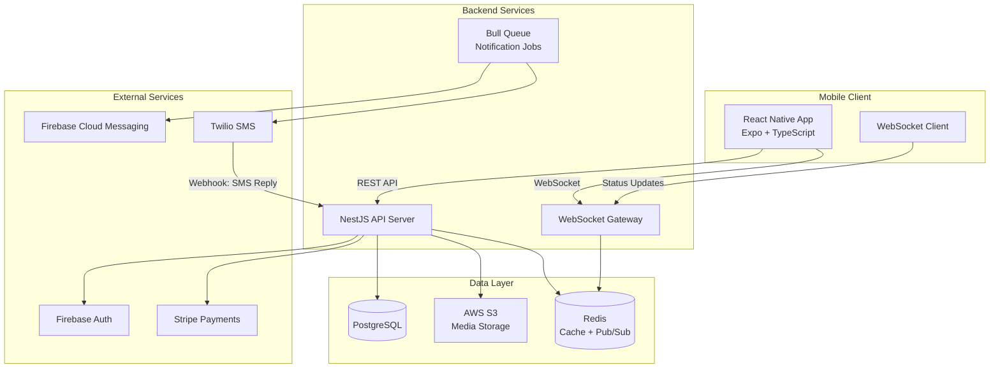
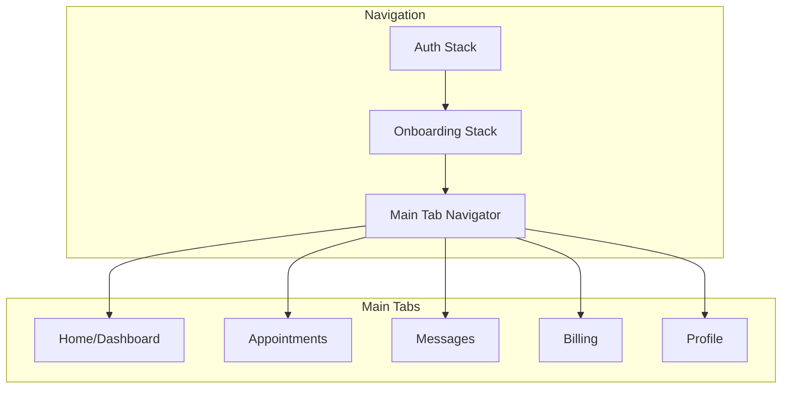
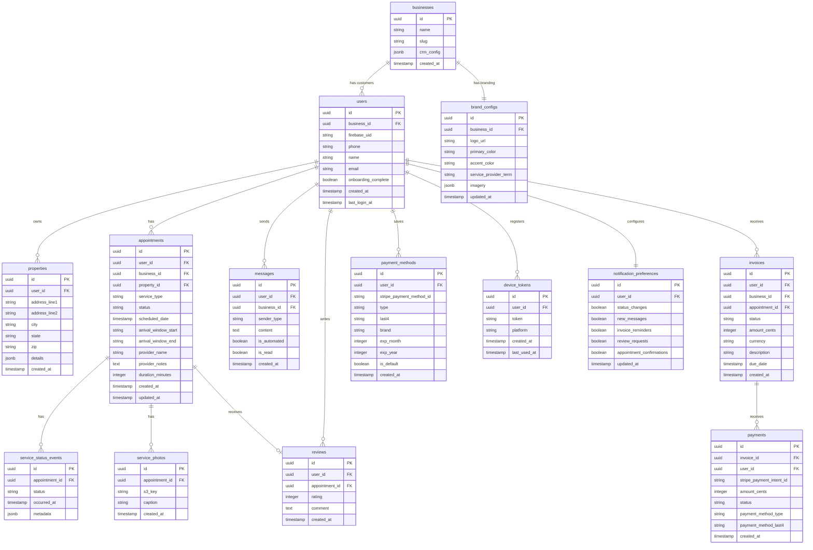

# Design Document: Servvo MVP Customer App

## Overview

The Servvo MVP Customer App is a white-label mobile application that provides homeowners with a branded, premium experience for managing their lawn care services. The app sits as a customer experience layer on top of existing CRMs (Jobber, Housecall Pro, ServiceTitan), presenting as the lawn care business's own app while powered by Servvo infrastructure.

### Key Design Decisions

1. **Status-based tracking** — No live GPS. Service progression uses discrete states (Scheduled → Provider Assigned → On The Way → Arrived → In Progress → Completed) updated via WebSocket for near-real-time delivery.
2. **No provider mobile app** — Status updates come from SMS replies (via Twilio webhook) or admin portal actions.
3. **Per-business branding** — Brand configuration (logo, colors, terminology, imagery) is fetched at app launch and cached locally.
4. **Configurable terminology** — "Provider", "Crew", "Team", or "Service Professional" is resolved at render time from brand config.
5. **Firebase Auth with phone OTP** — Leverages Firebase's built-in phone auth for secure, passwordless login.
6. **Stripe for payments** — Uses Stripe's React Native SDK with server-side PaymentIntent creation for PCI compliance.

## Architecture

### System Architecture Diagram



### Frontend Architecture



### Backend Architecture (NestJS Modules)

```
src/
├── app.module.ts
├── modules/
│   ├── auth/              # Firebase Auth verification, session management
│   ├── users/             # Homeowner profiles, onboarding
│   ├── businesses/        # Business config, branding
│   ├── appointments/      # CRUD, reschedule, cancel
│   ├── service-status/    # Status tracking, WebSocket events
│   ├── messages/          # Two-way messaging, automated messages
│   ├── invoices/          # Invoice management, Stripe integration
│   ├── payments/          # Payment processing, saved methods
│   ├── reviews/           # Ratings and reviews
│   ├── notifications/     # Push notifications, preferences
│   ├── properties/        # Property management
│   ├── bookings/          # Rebooking, service requests
│   └── media/             # S3 upload/retrieval
├── common/
│   ├── guards/            # Auth guard, business-context guard
│   ├── interceptors/      # Response transform, logging
│   ├── decorators/        # CurrentUser, BusinessContext
│   └── filters/           # Exception filters
└── config/
    └── database/          # TypeORM config, migrations
```

## Components and Interfaces

### API Endpoints

#### Auth Module
| Method | Endpoint | Description |
|--------|----------|-------------|
| POST | `/auth/verify-token` | Verify Firebase ID token, create/return session |
| POST | `/auth/logout` | Invalidate session |
| GET | `/auth/session` | Check session validity |

#### Users Module
| Method | Endpoint | Description |
|--------|----------|-------------|
| GET | `/users/me` | Get current user profile |
| PUT | `/users/me` | Update profile (name, email) |
| POST | `/users/me/onboarding` | Complete onboarding (profile + property) |
| GET | `/users/me/onboarding-status` | Check if onboarding is complete |

#### Businesses Module
| Method | Endpoint | Description |
|--------|----------|-------------|
| GET | `/businesses/:id/brand-config` | Get brand configuration |

#### Appointments Module
| Method | Endpoint | Description |
|--------|----------|-------------|
| GET | `/appointments` | List appointments (query: upcoming/past, pagination) |
| GET | `/appointments/:id` | Get appointment detail |
| POST | `/appointments/:id/reschedule` | Request reschedule |
| POST | `/appointments/:id/cancel` | Request cancellation |
| GET | `/appointments/next` | Get next upcoming appointment |

#### Service Status Module
| Method | Endpoint | Description |
|--------|----------|-------------|
| GET | `/appointments/:id/status` | Get current status |
| WebSocket | `status:update` | Real-time status change events |

#### Messages Module
| Method | Endpoint | Description |
|--------|----------|-------------|
| GET | `/messages` | Get conversation thread (pagination) |
| POST | `/messages` | Send a message |
| WebSocket | `message:new` | Real-time new message events |

#### Invoices Module
| Method | Endpoint | Description |
|--------|----------|-------------|
| GET | `/invoices` | List invoices (query: status filter, pagination) |
| GET | `/invoices/:id` | Get invoice detail |

#### Payments Module
| Method | Endpoint | Description |
|--------|----------|-------------|
| POST | `/payments/intent` | Create Stripe PaymentIntent |
| POST | `/payments/confirm` | Confirm payment completion |
| GET | `/payments/methods` | List saved payment methods |
| POST | `/payments/methods` | Save a payment method |
| DELETE | `/payments/methods/:id` | Remove saved payment method |
| GET | `/payments/history` | Get payment history |

#### Reviews Module
| Method | Endpoint | Description |
|--------|----------|-------------|
| POST | `/reviews` | Submit a review |
| GET | `/reviews` | Get user's reviews |
| GET | `/appointments/:id/review` | Get review for specific appointment |

#### Bookings Module
| Method | Endpoint | Description |
|--------|----------|-------------|
| GET | `/bookings/available-dates` | Get available dates for a service type |
| GET | `/bookings/available-windows` | Get time windows for a date |
| POST | `/bookings` | Submit a booking request |
| GET | `/bookings/recommendations` | Get seasonal service recommendations |

#### Notifications Module
| Method | Endpoint | Description |
|--------|----------|-------------|
| POST | `/notifications/register-device` | Register FCM device token |
| GET | `/notifications/preferences` | Get notification preferences |
| PUT | `/notifications/preferences` | Update notification preferences |

#### Properties Module
| Method | Endpoint | Description |
|--------|----------|-------------|
| GET | `/properties` | Get user's properties |
| POST | `/properties` | Create a property |
| PUT | `/properties/:id` | Update property details |

#### Media Module
| Method | Endpoint | Description |
|--------|----------|-------------|
| GET | `/media/:key` | Get signed URL for media |

### WebSocket Events

```typescript
// Client → Server
interface ClientEvents {
  'subscribe:appointment': { appointmentId: string };
  'unsubscribe:appointment': { appointmentId: string };
  'subscribe:messages': {};
  'unsubscribe:messages': {};
}

// Server → Client
interface ServerEvents {
  'status:update': {
    appointmentId: string;
    status: ServiceStatus;
    timestamp: string;
    arrivalWindow?: { start: string; end: string };
  };
  'message:new': {
    id: string;
    content: string;
    sender: 'business' | 'system';
    timestamp: string;
  };
}
```

### Frontend Component Structure

```
src/
├── app/                          # Expo Router entry
├── navigation/
│   ├── AuthStack.tsx
│   ├── OnboardingStack.tsx
│   └── MainTabNavigator.tsx
├── screens/
│   ├── auth/
│   │   ├── WelcomeScreen.tsx
│   │   ├── PhoneInputScreen.tsx
│   │   └── OTPScreen.tsx
│   ├── onboarding/
│   │   ├── ProfileSetupScreen.tsx
│   │   ├── PropertySetupScreen.tsx
│   │   └── ConfirmationScreen.tsx
│   ├── home/
│   │   └── DashboardScreen.tsx
│   ├── appointments/
│   │   ├── AppointmentsScreen.tsx
│   │   ├── AppointmentDetailScreen.tsx
│   │   └── RescheduleScreen.tsx
│   ├── messages/
│   │   └── MessagesScreen.tsx
│   ├── billing/
│   │   ├── BillingScreen.tsx
│   │   ├── InvoiceDetailScreen.tsx
│   │   └── PaymentScreen.tsx
│   ├── profile/
│   │   ├── ProfileScreen.tsx
│   │   └── NotificationPrefsScreen.tsx
│   ├── reviews/
│   │   └── ReviewFlowScreen.tsx
│   └── bookings/
│       └── RebookingScreen.tsx
├── components/
│   ├── ui/                       # Design system primitives
│   │   ├── Card.tsx
│   │   ├── Button.tsx
│   │   ├── Input.tsx
│   │   ├── Badge.tsx
│   │   ├── Avatar.tsx
│   │   └── Typography.tsx
│   ├── service-status/
│   │   ├── StatusProgressBar.tsx
│   │   ├── StatusBadge.tsx
│   │   ├── ArrivalMapCard.tsx
│   │   └── ETACountdown.tsx
│   ├── appointments/
│   │   ├── AppointmentCard.tsx
│   │   └── ServiceTimeline.tsx
│   ├── messages/
│   │   ├── MessageBubble.tsx
│   │   └── MessageInput.tsx
│   ├── billing/
│   │   ├── InvoiceCard.tsx
│   │   └── PaymentMethodCard.tsx
│   └── branding/
│       ├── BrandedHeader.tsx
│       └── BrandedLogo.tsx
├── hooks/
│   ├── useAuth.ts
│   ├── useBrandConfig.ts
│   ├── useWebSocket.ts
│   ├── useAppointments.ts
│   └── useNotifications.ts
├── services/
│   ├── api.ts                    # Axios instance with auth interceptor
│   ├── auth.service.ts
│   ├── appointments.service.ts
│   ├── messages.service.ts
│   ├── payments.service.ts
│   └── websocket.service.ts
├── stores/
│   ├── authStore.ts              # Zustand store
│   ├── brandStore.ts
│   ├── appointmentStore.ts
│   └── messageStore.ts
├── theme/
│   ├── tokens.ts                 # Design tokens
│   ├── BrandThemeProvider.tsx
│   └── defaultTheme.ts
└── utils/
    ├── terminology.ts            # Dynamic terminology resolver
    ├── formatters.ts             # Date, currency formatters
    └── validators.ts             # Input validation
```

### Design System Tokens

```typescript
// theme/tokens.ts
export const defaultTokens = {
  colors: {
    primary: '#1B365D',        // Deep blue
    primaryLight: '#2A4A7F',
    accent: '#4CAF50',         // Green
    accentLight: '#81C784',
    background: '#FFFFFF',
    surface: '#F8F9FA',
    surfaceElevated: '#FFFFFF',
    text: '#1A1A2E',
    textSecondary: '#6B7280',
    textMuted: '#9CA3AF',
    border: '#E5E7EB',
    error: '#EF4444',
    success: '#10B981',
    warning: '#F59E0B',
  },
  spacing: {
    xs: 4,
    sm: 8,
    md: 16,
    lg: 24,
    xl: 32,
    xxl: 48,
  },
  borderRadius: {
    sm: 8,
    md: 12,
    lg: 16,
    xl: 24,
    full: 9999,
  },
  shadows: {
    sm: { elevation: 2, shadowOffset: { width: 0, height: 1 }, shadowRadius: 3, shadowOpacity: 0.08 },
    md: { elevation: 4, shadowOffset: { width: 0, height: 2 }, shadowRadius: 6, shadowOpacity: 0.12 },
    lg: { elevation: 8, shadowOffset: { width: 0, height: 4 }, shadowRadius: 12, shadowOpacity: 0.15 },
  },
  typography: {
    h1: { fontSize: 28, fontWeight: '700', lineHeight: 34 },
    h2: { fontSize: 22, fontWeight: '600', lineHeight: 28 },
    h3: { fontSize: 18, fontWeight: '600', lineHeight: 24 },
    body: { fontSize: 16, fontWeight: '400', lineHeight: 22 },
    bodySmall: { fontSize: 14, fontWeight: '400', lineHeight: 20 },
    caption: { fontSize: 12, fontWeight: '400', lineHeight: 16 },
    button: { fontSize: 16, fontWeight: '600', lineHeight: 20 },
  },
};

// Brand config overrides primary/accent colors and terminology
export interface BrandConfig {
  businessId: string;
  logo: string;           // S3 URL
  colors: {
    primary: string;
    accent: string;
  };
  terminology: {
    serviceProvider: string;  // "Provider" | "Crew" | "Team" | "Service Professional"
  };
  imagery: {
    onboarding: string[];    // S3 URLs
    dashboard: string;       // S3 URL
  };
}
```

## Data Models

### Database Schema (PostgreSQL)



### Key TypeORM Entities

```typescript
// Appointment status enum
export enum ServiceStatus {
  SCHEDULED = 'scheduled',
  PROVIDER_ASSIGNED = 'provider_assigned',
  ON_THE_WAY = 'on_the_way',
  ARRIVED = 'arrived',
  IN_PROGRESS = 'in_progress',
  COMPLETED = 'completed',
  CANCELLED = 'cancelled',
}

// Invoice status enum
export enum InvoiceStatus {
  UNPAID = 'unpaid',
  PAID = 'paid',
  OVERDUE = 'overdue',
}

// Message sender type
export enum SenderType {
  CUSTOMER = 'customer',
  BUSINESS = 'business',
  SYSTEM = 'system',
}
```


## Correctness Properties

*A property is a characteristic or behavior that should hold true across all valid executions of a system — essentially, a formal statement about what the system should do. Properties serve as the bridge between human-readable specifications and machine-verifiable correctness guarantees.*

### Property 1: OTP Time-Based Validity

*For any* OTP and any timestamp within 5 minutes of issuance, verification should succeed. *For any* OTP and any timestamp beyond 5 minutes of issuance, verification should fail with an expiry error.

**Validates: Requirements 1.2, 1.4**

### Property 2: OTP Invalidation on Re-Request

*For any* phone number with a previously issued OTP, when a new OTP is requested, the previous OTP should no longer be accepted for verification regardless of its age.

**Validates: Requirements 1.5**

### Property 3: Onboarding Required Field Validation

*For any* onboarding submission where name or address is empty, null, or composed entirely of whitespace, the system should reject the submission and return a validation error.

**Validates: Requirements 2.4**

### Property 4: Brand Config Application

*For any* valid brand configuration containing colors and terminology, the resolved theme tokens should reflect the configured primary and accent colors, and all Service_Professional text references should use the configured terminology term.

**Validates: Requirements 3.3, 3.4**

### Property 5: Dashboard Next Appointment Selection

*For any* non-empty set of appointments with various dates and statuses, the dashboard should display the appointment with the earliest future scheduled_date that is not cancelled.

**Validates: Requirements 4.1**

### Property 6: Activity Feed Recency

*For any* list of service-related events, the activity feed should display exactly the 5 most recent events ordered by timestamp descending. If fewer than 5 events exist, all should be displayed.

**Validates: Requirements 4.4**

### Property 7: Appointment Time-Based Partitioning

*For any* set of appointments, partitioning into "upcoming" and "past" tabs should place all appointments with scheduled_date in the future into "upcoming" and all appointments with scheduled_date in the past into "past", with no appointment appearing in both or neither.

**Validates: Requirements 5.1**

### Property 8: Status Progress Representation

*For any* valid ServiceStatus value, the progress bar should mark all preceding stages as completed and the current stage as active, maintaining the correct sequential order: Scheduled → Provider Assigned → On The Way → Arrived → In Progress → Completed.

**Validates: Requirements 6.1**

### Property 9: Message Rendering Completeness

*For any* message with content and a creation timestamp, the rendered message display should contain both the message content and a formatted timestamp string.

**Validates: Requirements 7.2**

### Property 10: Automated Message Generation from Status Changes

*For any* service status change event, the system should generate a corresponding automated message in the conversation thread containing the new status and appointment reference.

**Validates: Requirements 7.4**

### Property 11: List Rendering Completeness

*For any* invoice, the rendered list item should contain the status, formatted amount, date, and service description. *For any* payment record, the rendered list item should contain the date, formatted amount, invoice reference, and payment method identifier.

**Validates: Requirements 8.1, 8.6**

### Property 12: Service History Chronological Ordering

*For any* list of past services, the service history display should present them in reverse chronological order (most recent first), and for any two adjacent items, the first should have a date equal to or later than the second.

**Validates: Requirements 9.1**

### Property 13: Service Type Filtering

*For any* service type filter applied to a list of services, every service in the filtered result should have a service_type matching the filter, and no service matching the filter should be excluded from the result.

**Validates: Requirements 9.5**

### Property 14: Review Validation

*For any* review submission with a rating between 1 and 5 (inclusive) and an optional comment string, the system should accept and persist the review. *For any* rating outside the range 1-5, the system should reject the submission.

**Validates: Requirements 10.3**

### Property 15: Rebooking Pre-Population

*For any* past service selected for rebooking, the booking form should be pre-populated with the service_type of that past service.

**Validates: Requirements 11.1**

### Property 16: Notification Deep-Link Routing

*For any* push notification with a type (status_change, message, invoice, review, appointment_confirmation), tapping the notification should navigate to the corresponding screen (appointment detail, messages, invoice detail, review flow, appointment detail respectively).

**Validates: Requirements 12.3**

### Property 17: Session Time Validity

*For any* authenticated session, the session should remain valid for any access attempt within 30 days of authentication. *For any* access attempt beyond 30 days, the session should be expired and re-authentication required.

**Validates: Requirements 13.1**

## Error Handling

### Client-Side Error Handling

| Error Category | Handling Strategy |
|---|---|
| Network failure | Show offline banner, queue actions for retry, use cached data |
| API 401 Unauthorized | Redirect to auth flow, clear stored tokens |
| API 422 Validation | Display field-level error messages from response |
| API 500 Server Error | Show generic error toast with retry option |
| WebSocket disconnect | Auto-reconnect with exponential backoff (1s, 2s, 4s, max 30s) |
| Stripe payment failure | Display Stripe error message, allow retry |
| Firebase Auth failure | Display specific error (invalid number, quota exceeded, network) |
| Image load failure | Show placeholder image with retry |

### Server-Side Error Handling

| Error Category | Handling Strategy |
|---|---|
| Database connection failure | Return 503, circuit breaker pattern |
| Firebase token verification failure | Return 401 with specific error code |
| Stripe API failure | Return 502, log error, notify ops |
| S3 upload/retrieval failure | Return 502, retry with backoff |
| Twilio SMS failure | Queue for retry, log failure |
| Invalid request data | Return 422 with validation error details |
| Rate limiting | Return 429 with Retry-After header |

### WebSocket Error Recovery

```typescript
// Reconnection strategy
const RECONNECT_CONFIG = {
  initialDelay: 1000,
  maxDelay: 30000,
  backoffMultiplier: 2,
  maxRetries: 10,
};

// On reconnect: re-subscribe to active appointment status channels
// On max retries exceeded: fall back to polling every 30 seconds
```

### Global Error Boundary

The app wraps all screens in a React error boundary that:
1. Catches unhandled render errors
2. Displays a friendly "Something went wrong" screen
3. Offers a "Try Again" button that resets the component tree
4. Logs the error to a monitoring service

## Testing Strategy

### Property-Based Testing

**Library:** fast-check (TypeScript)
**Configuration:** Minimum 100 iterations per property test

Property-based tests will validate the 17 correctness properties defined above. Each test will:
- Use fast-check arbitraries to generate random valid inputs
- Assert the universal property holds for all generated inputs
- Be tagged with: `Feature: servvo-mvp-customer-app, Property {number}: {title}`

**Key generators needed:**
- `arbitraryAppointment()` — random appointment with valid status, dates, service types
- `arbitraryMessage()` — random message with content, sender type, timestamp
- `arbitraryInvoice()` — random invoice with valid status, amount, dates
- `arbitraryBrandConfig()` — random brand config with valid colors and terminology
- `arbitraryReview()` — random review with rating and optional comment
- `arbitraryServiceStatusEvent()` — random status change event
- `arbitraryNotification()` — random notification with type and payload

### Unit Testing

**Library:** Jest + React Native Testing Library
**Focus areas:**
- Screen rendering (snapshot tests for key screens)
- Navigation flows (auth → onboarding → main)
- Component behavior (buttons, inputs, forms)
- Hook logic (useAuth, useBrandConfig, useWebSocket)
- Service layer (API call construction, response parsing)
- Utility functions (formatters, validators)

### Integration Testing

**Library:** Jest + Supertest (backend), Detox (mobile E2E)
**Focus areas:**
- API endpoint request/response cycles
- WebSocket connection and event delivery
- Firebase Auth token verification flow
- Stripe payment flow (test mode)
- Push notification delivery (mock FCM)
- Database queries and migrations

### Test Organization

```
tests/
├── properties/              # Property-based tests (fast-check)
│   ├── auth.property.ts
│   ├── branding.property.ts
│   ├── appointments.property.ts
│   ├── status.property.ts
│   ├── messages.property.ts
│   ├── billing.property.ts
│   ├── reviews.property.ts
│   ├── bookings.property.ts
│   ├── notifications.property.ts
│   └── generators/         # Shared arbitraries
│       └── index.ts
├── unit/                    # Unit tests (Jest)
│   ├── components/
│   ├── hooks/
│   ├── services/
│   └── utils/
└── integration/             # Integration tests
    ├── api/
    └── e2e/
```
