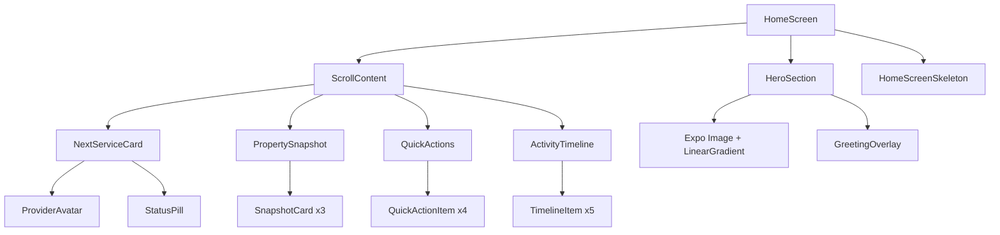
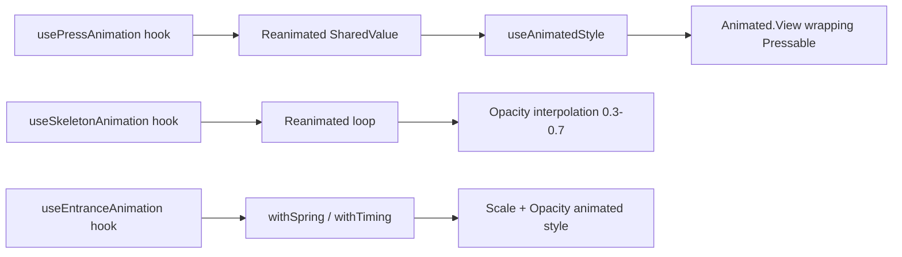

# Design Document: Servvo UI Redesign

## Overview

This design covers a frontend-only visual and interaction redesign of the Servvo mobile app. The goal is to elevate the existing React Native (Expo + TypeScript) app from functional to premium — evoking a luxury hospitality experience for a lawn care brand. No backend changes, no new APIs; all data remains mock data.

The redesign touches:
- Enhanced design tokens (shadows, gradients, typography variants)
- Redesigned core components (Button, Card, Typography, Avatar, Badge)
- New components (HeroSection, NextServiceCard, PropertySnapshot, QuickActions, ActivityTimeline, EmptyState, LoadingSkeleton, StatusPill, SuccessCheckmark)
- A shared animation system built on React Native Reanimated v3
- Press interaction patterns via a reusable hook
- Image handling with Expo Image and graceful fallbacks

The architecture preserves the existing `BrandThemeProvider` + Zustand pattern and extends it with new token categories (gradients, enhanced shadows, new typography variants).

## Architecture

### High-Level Component Tree (Home Screen)



### Animation Architecture



### File Structure

```
apps/mobile/src/
├── theme/
│   ├── tokens.ts              (EXTENDED: gradients, new typography, enhanced shadows)
│   ├── defaultTheme.ts        (EXTENDED: gradient tokens in theme)
│   └── BrandThemeProvider.tsx  (UNCHANGED)
├── hooks/
│   ├── usePressAnimation.ts   (NEW: shared press interaction hook)
│   ├── useSkeletonAnimation.ts (NEW: skeleton pulse/shimmer hook)
│   └── useEntranceAnimation.ts (NEW: mount entrance animation hook)
├── components/
│   ├── ui/
│   │   ├── Button.tsx         (REDESIGNED: gradient, spring press, new sizing)
│   │   ├── Card.tsx           (REDESIGNED: enhanced shadows, no border, top highlight)
│   │   ├── Typography.tsx     (EXTENDED: display, subtitle, light variants)
│   │   ├── Avatar.tsx         (EXTENDED: primary-tinted border option)
│   │   ├── Badge.tsx          (UNCHANGED)
│   │   ├── Input.tsx          (UNCHANGED)
│   │   ├── StatusPill.tsx     (NEW)
│   │   ├── EmptyState.tsx     (NEW)
│   │   ├── LoadingSkeleton.tsx (NEW)
│   │   ├── SuccessCheckmark.tsx (NEW)
│   │   └── ImageWithFallback.tsx (NEW)
│   └── home/
│       ├── HeroSection.tsx    (NEW)
│       ├── NextServiceCard.tsx (NEW)
│       ├── PropertySnapshot.tsx (NEW)
│       ├── QuickActions.tsx   (NEW)
│       ├── ActivityTimeline.tsx (NEW)
│       └── HomeScreenSkeleton.tsx (NEW)
├── screens/
│   └── home/
│       └── DashboardScreen.tsx (REDESIGNED)
└── utils/
    ├── colorUtils.ts          (NEW: opacity, darken, contrast helpers)
    ├── greetingUtils.ts       (NEW: time-of-day greeting logic)
    └── seasonalTips.ts        (NEW: month-to-tip mapping)
```

## Components and Interfaces

### Extended Design Tokens

```typescript
// Additions to tokens.ts

export const defaultTokens = {
  // ... existing tokens preserved ...

  colors: {
    // ... existing colors ...
    primaryOpacity10: 'rgba(45, 74, 45, 0.10)',  // Derived at runtime
    primaryOpacity20: 'rgba(45, 74, 45, 0.20)',
    primaryOpacity5: 'rgba(45, 74, 45, 0.05)',
  },

  gradients: {
    heroOverlay: ['transparent', 'rgba(250, 250, 245, 0.0)', 'rgba(250, 250, 245, 0.85)', '#FAFAF5'],
    buttonPrimary: ['#2D4A2D', '#264026'],  // primary to 10% darker
  },

  shadows: {
    // Enhanced shadows
    sm: {
      elevation: 2,
      shadowOffset: { width: 0, height: 2 },
      shadowRadius: 6,
      shadowOpacity: 0.06,
    },
    md: {
      elevation: 4,
      shadowOffset: { width: 0, height: 4 },
      shadowRadius: 12,
      shadowOpacity: 0.08,
    },
    lg: {
      elevation: 8,
      shadowOffset: { width: 0, height: 8 },
      shadowRadius: 24,
      shadowOpacity: 0.12,
    },
  },

  typography: {
    // ... existing variants ...
    display: { fontSize: 36, fontWeight: '700' as const, lineHeight: 42 },
    subtitle: { fontSize: 14, fontWeight: '600' as const, lineHeight: 18, letterSpacing: 0.5 },
    displayNumber: { fontSize: 32, fontWeight: '300' as const, lineHeight: 40 },
    bodyEmphasis: { fontSize: 16, fontWeight: '600' as const, lineHeight: 24 },
    button: { fontSize: 17, fontWeight: '600' as const, lineHeight: 20, letterSpacing: 0.3 },
  },

  animation: {
    press: { scale: 0.98, opacity: 0.7, duration: 100 },
    buttonPress: { scaleIn: 0.96, durationIn: 150, durationOut: 200 },
    skeleton: { opacityMin: 0.3, opacityMax: 0.7, duration: 1200 },
    entrance: { initialScale: 0.8, duration: 300 },
    transition: { duration: 300 },
    success: { duration: 400 },
  },
};
```

### usePressAnimation Hook

```typescript
// hooks/usePressAnimation.ts
import { useSharedValue, useAnimatedStyle, withSpring, withTiming } from 'react-native-reanimated';

interface PressAnimationConfig {
  scalePressed?: number;    // default: 0.98
  opacityPressed?: number;  // default: 0.7
  duration?: number;        // default: 100ms
  disabled?: boolean;       // suppresses animation when true
  springConfig?: { damping: number; stiffness: number };
}

interface PressAnimationReturn {
  animatedStyle: ReturnType<typeof useAnimatedStyle>;
  onPressIn: () => void;
  onPressOut: () => void;
}

export function usePressAnimation(config?: PressAnimationConfig): PressAnimationReturn;
```

### useSkeletonAnimation Hook

```typescript
// hooks/useSkeletonAnimation.ts
import { useSharedValue, useAnimatedStyle } from 'react-native-reanimated';

interface SkeletonAnimationReturn {
  animatedStyle: ReturnType<typeof useAnimatedStyle>;
}

export function useSkeletonAnimation(): SkeletonAnimationReturn;
// Returns an animated style that pulses opacity between 0.3 and 0.7 over 1.2s loop
```

### useEntranceAnimation Hook

```typescript
// hooks/useEntranceAnimation.ts
interface EntranceAnimationConfig {
  initialScale?: number;  // default: 0.8
  duration?: number;      // default: 300ms
  delay?: number;         // default: 0
}

interface EntranceAnimationReturn {
  animatedStyle: ReturnType<typeof useAnimatedStyle>;
}

export function useEntranceAnimation(config?: EntranceAnimationConfig): EntranceAnimationReturn;
```

### HeroSection Component

```typescript
// components/home/HeroSection.tsx
interface HeroSectionProps {
  imageUri: string;
  firstName: string;
}

// Renders:
// - Full-width Image (Expo Image) with minHeight 220
// - LinearGradient overlay (expo-linear-gradient)
// - Personalized greeting with time-of-day logic
// - Position: absolute, stays stationary during scroll (parallax effect)
```

### NextServiceCard Component

```typescript
// components/home/NextServiceCard.tsx
interface Appointment {
  id: string;
  date: string;
  time: string;
  serviceType: string;
  providerName: string;
  providerAvatarUri?: string;
  status: 'confirmed' | 'scheduled' | 'en_route';
}

interface NextServiceCardProps {
  appointment: Appointment | null;
  onPress?: () => void;
}

// When appointment is null, renders EmptyState with booking CTA
// Uses usePressAnimation for tactile feedback (0.97 scale)
// Displays ProviderAvatar (40px min), StatusPill, structured info
```

### PropertySnapshot Component

```typescript
// components/home/PropertySnapshot.tsx
interface PropertySnapshotProps {
  healthStatus: 'thriving' | 'good' | 'needs_attention';
  lastServiceDate: string;
  currentMonth: number; // 1-12
}

// Renders 3 compact cards in a horizontal row:
// 1. Health indicator with colored icon
// 2. Last service date
// 3. Seasonal tip (derived from currentMonth)
```

### QuickActions Component

```typescript
// components/home/QuickActions.tsx
interface QuickActionItem {
  id: string;
  icon: string; // Feather icon name
  label: string;
  onPress: () => void;
}

interface QuickActionsProps {
  actions: QuickActionItem[]; // Max 4 rendered regardless of array length
}

// Each item: 64x64 min touch target
// Filled icon container: primary color at 10% opacity bg, primary icon color
// Uses usePressAnimation for press feedback
// Caption label below icon
```

### ActivityTimeline Component

```typescript
// components/home/ActivityTimeline.tsx
interface ServiceEvent {
  id: string;
  title: string;
  timestamp: Date;
  status: 'completed' | 'scheduled';
}

interface ActivityTimelineProps {
  events: ServiceEvent[]; // Shows max 5, reverse chronological
}

// Each event: status icon (checkmark/clock) + title + relative timestamp
// Vertical line connecting events
// Empty state when no events
```

### StatusPill Component

```typescript
// components/ui/StatusPill.tsx
interface StatusPillProps {
  status: 'confirmed' | 'scheduled' | 'en_route' | 'completed';
  animated?: boolean; // entrance animation on mount
}

// Color mapping:
// confirmed → green bg, green text
// scheduled → blue bg, blue text
// en_route → amber bg, amber text
// completed → green bg, green text
// Uses useEntranceAnimation when animated=true (0.8→1.0 scale, 300ms)
```

### EmptyState Component

```typescript
// components/ui/EmptyState.tsx
interface EmptyStateProps {
  screenType: 'appointments' | 'messages' | 'payments' | 'activity' | 'properties';
  onAction?: () => void;
  actionLabel?: string;
}

// Maps screenType to:
// - Contextual Feather icon
// - Warm headline (e.g., "Your service story starts here")
// - Supportive body message
// - Optional CTA button (only when onAction provided)
```

### LoadingSkeleton Component

```typescript
// components/ui/LoadingSkeleton.tsx
interface SkeletonProps {
  width: number | string;
  height: number;
  borderRadius?: number;
  style?: ViewStyle;
}

// Renders a rounded rectangle with shimmer animation
// Uses useSkeletonAnimation for consistent pulse
// borderRadius defaults to match target component's token value
```

### ImageWithFallback Component

```typescript
// components/ui/ImageWithFallback.tsx
interface ImageWithFallbackProps {
  uri: string;
  fallbackIcon?: string; // Feather icon name, default: 'image'
  style?: ViewStyle;
  borderRadius?: number;
}

// Uses Expo Image for optimized loading
// On error: shows branded placeholder (primary at 5% opacity bg + icon)
// Warm golden-hour placeholder aesthetic
```

### SuccessCheckmark Component

```typescript
// components/ui/SuccessCheckmark.tsx
interface SuccessCheckmarkProps {
  visible: boolean;
  onComplete?: () => void;
}

// Animated checkmark with draw-on effect over 400ms
// Uses Reanimated + SVG path animation
// Triggers onComplete callback after animation finishes
```

### Redesigned Button Component

```typescript
// components/ui/Button.tsx (updated interface)
export interface ButtonProps {
  title: string;
  onPress: () => void;
  variant?: 'primary' | 'secondary' | 'ghost';
  disabled?: boolean;
  loading?: boolean;
  style?: ViewStyle;
}

// Changes from current:
// - minHeight: 52 for primary variant
// - borderRadius: 14 (was tokens.borderRadius.lg = 16)
// - Primary variant: LinearGradient background (primary → 10% darker)
// - Press: spring animation to 0.96 scale (150ms in, 200ms out)
// - Font: size 17, weight 600, letterSpacing 0.3
// - Uses usePressAnimation hook internally
```

### Redesigned Card Component

```typescript
// components/ui/Card.tsx (updated interface)
export interface CardProps {
  children: React.ReactNode;
  style?: ViewStyle;
  variant?: 'default' | 'elevated';
  onPress?: () => void; // NEW: optional press handler
}

// Changes from current:
// - No border (borderWidth: 0)
// - Default shadow: offset 4px, blur 12px, opacity 0.08
// - Elevated shadow: offset 8px, blur 24px, opacity 0.12
// - borderRadius: 16
// - Elevated variant: 1px top highlight (white at 50% opacity)
// - When onPress provided: wraps in Animated.View with usePressAnimation
```

### Extended Typography Component

```typescript
// components/ui/Typography.tsx (updated interface)
export interface TypographyProps {
  variant?: 'display' | 'h1' | 'h2' | 'h3' | 'subtitle' | 'body' | 'bodyEmphasis' | 'bodySmall' | 'caption' | 'displayNumber';
  color?: string;
  children: React.ReactNode;
  style?: TextStyle;
  numberOfLines?: number;
}
```

### Utility Functions

```typescript
// utils/colorUtils.ts
export function withOpacity(hexColor: string, opacity: number): string;
// Converts hex to rgba with given opacity (0-1)

export function darken(hexColor: string, amount: number): string;
// Darkens a hex color by a percentage (0-1)

export function contrastRatio(foreground: string, background: string): number;
// Computes WCAG contrast ratio between two colors

// utils/greetingUtils.ts
export function getTimeOfDayGreeting(hour: number): 'morning' | 'afternoon' | 'evening';
// 5-11: morning, 12-16: afternoon, 17-4: evening

export function buildGreeting(firstName: string, hour: number): string;
// Returns personalized greeting string

// utils/seasonalTips.ts
export function getSeasonalTip(month: number): string;
// Maps month (1-12) to a relevant lawn care tip
```

## Data Models

All data is mock data. No backend integration.

### Mock Data Structures

```typescript
// Mock appointment for NextServiceCard
interface MockAppointment {
  id: string;
  date: string;           // ISO date string
  time: string;           // "8:00 AM" format
  serviceType: string;    // "Weekly Lawn Mowing"
  providerName: string;   // "Marcus J."
  providerAvatarUri: string; // Unsplash URL
  status: 'confirmed' | 'scheduled' | 'en_route';
}

// Mock service events for ActivityTimeline
interface MockServiceEvent {
  id: string;
  title: string;          // "Lawn Mowing Completed"
  timestamp: Date;
  status: 'completed' | 'scheduled';
}

// Mock property data for PropertySnapshot
interface MockPropertyData {
  healthStatus: 'thriving' | 'good' | 'needs_attention';
  lastServiceDate: string; // ISO date
}

// Mock user (extends existing auth store user)
interface MockUser {
  name: string;           // "Alex Thompson"
  propertyImageUri: string; // Unsplash lawn photo URL
}
```

### Mock Data Source

```typescript
// data/mockHomeData.ts
export const mockAppointment: MockAppointment = {
  id: '1',
  date: '2024-05-22',
  time: '8:00 AM',
  serviceType: 'Weekly Lawn Mowing',
  providerName: 'Marcus J.',
  providerAvatarUri: 'https://images.unsplash.com/photo-...',
  status: 'confirmed',
};

export const mockEvents: MockServiceEvent[] = [/* 5 events */];
export const mockProperty: MockPropertyData = { healthStatus: 'thriving', lastServiceDate: '2024-05-15' };
```

## Correctness Properties

*A property is a characteristic or behavior that should hold true across all valid executions of a system — essentially, a formal statement about what the system should do. Properties serve as the bridge between human-readable specifications and machine-verifiable correctness guarantees.*

### Property 1: Time-of-day greeting correctness

*For any* valid first name (non-empty string) and any hour of the day (0-23), the `buildGreeting` function SHALL return a string that contains the first name and uses the correct time-of-day segment: "morning" for hours 5-11, "afternoon" for hours 12-16, and "evening" for hours 17-23 and 0-4.

**Validates: Requirements 1.3**

### Property 2: Text contrast compliance

*For any* valid theme color configuration (text color and background color pair), all body-level text variants SHALL maintain a minimum WCAG contrast ratio of 4.5:1 as computed by the `contrastRatio` utility function.

**Validates: Requirements 1.4, 12.3**

### Property 3: Appointment data completeness

*For any* valid appointment object (with non-empty date, time, serviceType, and providerName fields), the NextServiceCard render output SHALL contain all four data fields in its rendered text content.

**Validates: Requirements 2.3**

### Property 4: Seasonal tip coverage

*For any* month value from 1 to 12, the `getSeasonalTip` function SHALL return a non-empty string.

**Validates: Requirements 3.3**

### Property 5: Quick actions maximum constraint

*For any* array of QuickActionItem objects (length 0 to N), the QuickActions component SHALL render at most 4 action items regardless of input array length.

**Validates: Requirements 4.1**

### Property 6: Color derivation from theme primary

*For any* valid hex color string used as the primary color in a BrandConfig, all derived color values (icon container backgrounds, avatar borders, image fallback backgrounds, button gradient endpoints) SHALL be mathematically computed from that primary color using the `withOpacity` and `darken` utility functions, with no hardcoded color values.

**Validates: Requirements 4.3, 6.3, 8.2, 8.4, 13.1, 13.4**

### Property 7: Timeline ordering and cap

*For any* array of ServiceEvent objects with random timestamps, the ActivityTimeline component SHALL render at most 5 events, and those events SHALL be in strictly descending chronological order (most recent first).

**Validates: Requirements 5.1**

### Property 8: Timeline event completeness

*For any* valid ServiceEvent object (with non-empty title and valid timestamp), the rendered timeline item SHALL contain the event title and a relative timestamp string.

**Validates: Requirements 5.2**

### Property 9: Empty state content mapping

*For any* valid screen type from the set {'appointments', 'messages', 'payments', 'activity', 'properties'}, the EmptyState component SHALL render a non-empty headline that does not contain generic phrases ("No data", "Nothing here", "Empty") and SHALL render a non-null icon.

**Validates: Requirements 10.1, 10.2**

### Property 10: Onboarding progress indicator accuracy

*For any* pair (currentStep, totalSteps) where 1 ≤ currentStep ≤ totalSteps and totalSteps ≥ 1, the progress indicator SHALL render exactly totalSteps indicator elements with exactly currentStep elements marked as active/completed.

**Validates: Requirements 11.1**

### Property 11: Typography vertical rhythm

*For all* typography token variants defined in the design token system, the lineHeight value SHALL be a positive integer that is evenly divisible by 4.

**Validates: Requirements 12.5**

### Property 12: Skeleton shape matching

*For any* component type that has a corresponding skeleton placeholder, the skeleton's borderRadius SHALL equal the component's borderRadius as defined in the design tokens.

**Validates: Requirements 14.2**

### Property 13: Disabled state suppresses press animation

*For any* interactive component in a disabled or loading state, invoking the press handler SHALL NOT trigger scale or opacity animation changes (the shared values SHALL remain at their default resting values of scale=1.0 and opacity=1.0).

**Validates: Requirements 15.4**

## Error Handling

### Image Loading Failures

- **Strategy**: The `ImageWithFallback` component catches `onError` from Expo Image and swaps to a branded placeholder view (primary color at 5% opacity background + Feather landscape icon).
- **User experience**: No broken image icons. The placeholder maintains the warm aesthetic.

### Missing Mock Data

- **Strategy**: Each Home Screen section handles null/empty data gracefully via the `EmptyState` component.
- **NextServiceCard**: Shows "Book your first service" CTA when appointment is null.
- **ActivityTimeline**: Shows "Your service story starts here" when events array is empty.
- **PropertySnapshot**: Falls back to "Good" health status and "No services yet" when data is missing.

### Animation Failures

- **Strategy**: All animations use `react-native-reanimated` worklets running on the UI thread. If a shared value fails to initialize, components render in their resting state (scale 1.0, opacity 1.0) — no visual breakage.
- **Fallback**: The `usePressAnimation` hook returns no-op handlers when `disabled` is true, preventing animation on non-interactive elements.

### Theme/Brand Config Errors

- **Strategy**: The existing `BrandThemeProvider` already falls back to `defaultTheme` when no brand config is present. The `withOpacity` and `darken` utility functions validate hex input and return the original color unchanged if parsing fails.

### Loading State Management

- **Strategy**: The Home Screen uses a simple `isLoading` state. While true, `HomeScreenSkeleton` renders. On data ready, a 200ms crossfade transitions to real content. If loading exceeds 10 seconds, a retry prompt appears.

## Testing Strategy

### Property-Based Tests (fast-check)

The project already has `fast-check` in devDependencies. Each correctness property maps to a single property-based test with minimum 100 iterations.

**Library**: `fast-check` (already installed)
**Runner**: Jest (already configured via `jest-expo`)
**Minimum iterations**: 100 per property test
**Tag format**: `Feature: servvo-ui-redesign, Property {N}: {title}`

Property tests target the pure utility functions and component logic:
- `colorUtils.ts` — withOpacity, darken, contrastRatio
- `greetingUtils.ts` — getTimeOfDayGreeting, buildGreeting
- `seasonalTips.ts` — getSeasonalTip
- Component rendering logic (max items, sorting, field presence)

### Unit Tests (example-based)

Example-based tests cover:
- Specific shadow values for Card variants (7.1, 7.2)
- Button dimensions and typography values (6.1, 6.2, 6.6)
- StatusPill color mapping for each status value (2.2)
- Animation configuration values (press timing, skeleton timing, entrance timing)
- Empty state conditional rendering (CTA button presence)
- Skeleton layout dimensions matching real components

### Integration Tests

- White-label theme application: apply a BrandConfig and verify all components reflect new colors within one render
- Home Screen loading flow: verify skeleton → content transition
- Press state consistency: verify all Pressable components use the shared hook

### Test File Structure

```
apps/mobile/src/
├── utils/__tests__/
│   ├── colorUtils.property.test.ts    (Properties 2, 6)
│   ├── greetingUtils.property.test.ts (Property 1)
│   ├── seasonalTips.property.test.ts  (Property 4)
│   └── colorUtils.test.ts            (example-based edge cases)
├── components/ui/__tests__/
│   ├── Button.test.tsx
│   ├── Card.test.tsx
│   ├── EmptyState.property.test.tsx   (Property 9)
│   ├── LoadingSkeleton.test.tsx
│   ├── StatusPill.test.tsx
│   └── Typography.property.test.tsx   (Property 11)
├── components/home/__tests__/
│   ├── QuickActions.property.test.tsx (Property 5)
│   ├── ActivityTimeline.property.test.tsx (Properties 7, 8)
│   ├── NextServiceCard.property.test.tsx (Property 3)
│   └── HeroSection.test.tsx
├── hooks/__tests__/
│   ├── usePressAnimation.property.test.ts (Property 13)
│   └── useSkeletonAnimation.test.ts
└── theme/__tests__/
    ├── tokens.property.test.ts        (Property 11)
    └── brandTheme.property.test.ts    (Property 6)
```

### Dependencies to Add

```json
{
  "dependencies": {
    "react-native-reanimated": "~3.16.0",
    "expo-image": "~2.0.0",
    "expo-linear-gradient": "~14.0.0"
  }
}
```

These are the only new runtime dependencies. All are well-maintained Expo-compatible packages pinned to compatible versions for Expo SDK 52.
